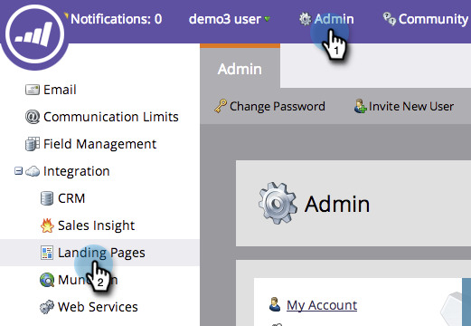

# 將行銷人員重新導向至著陸頁面至其他頁面 {#redirect-a-marketo-landing-page-to-another-page}

如果您更新頁面的URL，並希望舊URL仍能運作，請嘗試重新導向！ 設定起來很簡單。

>[!NOTE]
>
>**需要管理員權限**

1. 在「管 **理員**」下方，按一 **下「著陸****頁面**」。

   

1. 在「規 **則** 」頁籤下，按一下「新建規則 **」，然** 後按一下「新 **建重**********&#x200B;新導向規則」。

   

1. 按一下「 **第** 一 **個原始****URL」下拉式清單，然後選取您的Marketo CNAME**縮圖。

   

   >[!NOTE]
   >
   >**提醒**
   >
   >
   >請記住，您只能重新導向以您的Marketo [CNAME開頭的URL](customize-your-landing-page-urls-with-a-cname.md)。

1. 在第二個「原始URL」欄位中，選擇您要重 **新導向的著陸頁面** 。

   

   >[!NOTE]
   >
   >您可以輸入任何URL路徑，即使頁面或目錄不存在亦然。

1. 按一 **下「重** 新導向 **URL** 」下拉式清單，並選取您要將訪客重新導向至的頁面。

   

1. 按一下 **建立**。

   

   >[!TIP]
   >
   >若要重新導向至Marketo以外的網頁，請按一 **下「使用非Marketo登陸頁面」**。

   >[!NOTE]
   >
   >**相關文章**
   >
   >    
   >    
   >    * [重新導向URL路徑](../../../../product-docs/demand-generation/landing-pages/personalizing-landing-pages/redirect-a-url-path.md)

行銷英雄，快跟上！