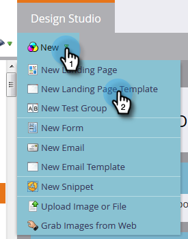

# 建立自由格式登陸頁面範本 {#create-a-free-form-landing-page-template}

自由格式登陸頁面所需的技術知識少於其引導式對應頁面。 若要建立未來登入頁面的範本，請遵循下列步驟。

1. 前往 **[!UICONTROL Design Studio]**。

   

1. 按一下&#x200B;**[!UICONTROL New]**，然後選取&#x200B;**[!UICONTROL New Landing Page Template]**。

   

1. 選擇您的資料夾，然後為您的範本命名。 自由格式是預設的編輯模式，因此在您命名範本後，請按一下&#x200B;**[!UICONTROL Create]**。

   

1. 您的範本應在新標籤中開啟。 任何熟悉CSS/HTML的人現在都能編輯它。

   

   >[!NOTE]
   >
   >Marketo支援未設定為協助疑難排解自訂HTML。 如需HTML的協助，請洽詢網頁開發人員。

1. 完成編輯後，按一下&#x200B;**[!UICONTROL Template Actions]**，然後選取&#x200B;**[!UICONTROL Approve and Close]**。

   

   >[!NOTE]
   >
   >若要防止表單預先填入，或不想追蹤特定頁面上的網頁行為，請選取&#x200B;**[!UICONTROL Disable Munchkin Tracking]**。
   >選取&#x200B;**[!UICONTROL Validate Mobile Compatibility]**&#x200B;以確定您的程式碼與行動裝置相容。

   >[!MORELIKETHIS]
   >
   >* [建立自由格式的登陸頁面](/help/marketo/product-docs/demand-generation/landing-pages/free-form-landing-pages/create-a-free-form-landing-page.md)
   >* [建立引導式登入頁面範本](/help/marketo/product-docs/demand-generation/landing-pages/landing-page-templates/create-a-guided-landing-page-template.md)
   >* [瞭解自由表單與引導式登陸頁面](/help/marketo/product-docs/demand-generation/landing-pages/understanding-landing-pages/understanding-free-form-vs-guided-landing-pages.md)
