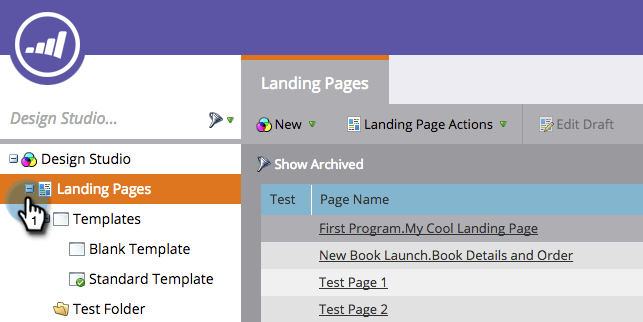

# 編輯Marketo登錄頁面範本 {#edit-a-marketo-landing-page-template}

您可以在Marketo中編輯任何登錄頁面範本。

1. 前往 **Design Studio**.

   

1. 展開 **登錄頁面** 以顯示範本。

   

1. 選取 **範本** 您想要編輯。 按一下 **編輯草稿**.

   

   完成! 現在，您可以編輯範本的CSS，並完全控制其外觀和版面。

   >[!NOTE]
   >
   >當您編輯登錄頁面範本時，它會使用該範本建立任何登錄頁面資產的草稿。
