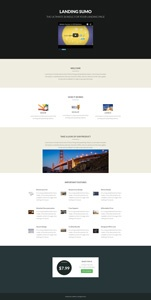

# 引導式登陸頁面範本清單 {#guided-landing-page-template-list}

瀏覽範例範本的集合，以搭配[引導式登陸頁面編輯器](/help/marketo/product-docs/demand-generation/landing-pages/guided-landing-pages/create-a-guided-landing-page.md)使用。 每個範本都能完全回應，並以Bootstrap框架為基礎。

>[!NOTE]
>
>Marketo支援未設定為協助疑難排解HTML。 如果您需要修改這些範本的協助，請洽詢網頁開發人員。

若要將範本匯入Marketo：

1. 按一下範本名稱即可檢視大圖。
1. 下載所選的範本。
1. 在Marketo中，導覽至&#x200B;**Design Studio。**
1. 按一下左側樹狀結構中的&#x200B;**登入頁面**，然後選取&#x200B;**範本。**

1. 在功能表列中，按一下&#x200B;**匯入範本。**
1. 選擇下載的檔案，輸入範本名稱，然後按一下&#x200B;**匯入** （請確定選取描述性名稱，並指示編輯模式為&#x200B;**引導式**）。

<table>
<tr>
<td><a href="/help/marketo/product-docs/demand-generation/landing-pages/landing-page-templates/guided-landing-page-templates/template-1a.md">範本1A</a></td>
<td><a href="/help/marketo/product-docs/demand-generation/landing-pages/landing-page-templates/guided-landing-page-templates/template-1b.md">範本1B</a></td>
<td><a href="/help/marketo/product-docs/demand-generation/landing-pages/landing-page-templates/guided-landing-page-templates/template-1c.md">範本1C</a></td>
<tr>
<td></td>
<td></td>
<td></td>
</tr>
<tr>
<td><a href="/help/marketo/product-docs/demand-generation/landing-pages/landing-page-templates/guided-landing-page-templates/template-1d.md">1D範本</a></td>
<td><a href="/help/marketo/product-docs/demand-generation/landing-pages/landing-page-templates/guided-landing-page-templates/template-1e.md">範本1E</a></td>
<td><a href="/help/marketo/product-docs/demand-generation/landing-pages/landing-page-templates/guided-landing-page-templates/template-1f.md">範本1F</a></td>
</tr>
<tr>
<td></td>
<td></td>
<td></td>
</tr>
<tr>
<td><a href="/help/marketo/product-docs/demand-generation/landing-pages/landing-page-templates/guided-landing-page-templates/template-2a.md">範本2A</a></td>
<td><a href="/help/marketo/product-docs/demand-generation/landing-pages/landing-page-templates/guided-landing-page-templates/template-2b.md">範本2B</a></td>
<td><a href="/help/marketo/product-docs/demand-generation/landing-pages/landing-page-templates/guided-landing-page-templates/template-2c.md">範本2C</a></td>
</tr>
<tr>
<td></td>
<td></td>
<td></td>
</tr>
<tr>
<td><a href="/help/marketo/product-docs/demand-generation/landing-pages/landing-page-templates/guided-landing-page-templates/template-2d.md">2D範本</a></td>
<td><a href="/help/marketo/product-docs/demand-generation/landing-pages/landing-page-templates/guided-landing-page-templates/template-3a.md">範本3A</a></td>
<td><a href="/help/marketo/product-docs/demand-generation/landing-pages/landing-page-templates/guided-landing-page-templates/template-3b.md">範本3B</a></td>
</tr>
<tr>
<td></td>
<td></td>
<td></td>
</tr>
<tr>
<td><a href="/help/marketo/product-docs/demand-generation/landing-pages/landing-page-templates/guided-landing-page-templates/template-3c.md">範本3C</a></td>
<td><a href="/help/marketo/product-docs/demand-generation/landing-pages/landing-page-templates/guided-landing-page-templates/template-3d.md">3D範本</a></td>
<td><a href="/help/marketo/product-docs/demand-generation/landing-pages/landing-page-templates/guided-landing-page-templates/template-4a.md">範本4A</a></td>
</tr>
<tr>
<td></td>
<td></td>
<td></td>
</tr>
<tr>
<td><a href="/help/marketo/product-docs/demand-generation/landing-pages/landing-page-templates/guided-landing-page-templates/template-4b.md">範本4B</a></td>
<td><a href="/help/marketo/product-docs/demand-generation/landing-pages/landing-page-templates/guided-landing-page-templates/template-4c.md">範本4C</a></td>
<td><a href="/help/marketo/product-docs/demand-generation/landing-pages/landing-page-templates/guided-landing-page-templates/template-5a.md">範本5A</a></td>
</tr>
<tr>
<td></td>
<td></td>
<td></td>
</tr>
<tr>
<td><a href="/help/marketo/product-docs/demand-generation/landing-pages/landing-page-templates/guided-landing-page-templates/template-5b.md">範本5B</a></td>
<td><a href="/help/marketo/product-docs/demand-generation/landing-pages/landing-page-templates/guided-landing-page-templates/template-5c.md">範本5C</a></td>
<td><a href="/help/marketo/product-docs/demand-generation/landing-pages/landing-page-templates/guided-landing-page-templates/template-5d.md">範本5D</a></td>
</tr>
<tr>
<td></td>
<td></td>
<td></td>
</tr>
<tr>
<td><a href="/help/marketo/product-docs/demand-generation/landing-pages/landing-page-templates/guided-landing-page-templates/template-5e.md">範本5E</a></td>
<td><a href="/help/marketo/product-docs/demand-generation/landing-pages/landing-page-templates/guided-landing-page-templates/template-6a.md">範本6A</a></td>
<td><a href="/help/marketo/product-docs/demand-generation/landing-pages/landing-page-templates/guided-landing-page-templates/template-6b.md">範本6B</a></td>
</tr>
<tr>
<td></td>
<td></td>
<td></td>
</tr>
<tr>
<td><a href="/help/marketo/product-docs/demand-generation/landing-pages/landing-page-templates/guided-landing-page-templates/template-6c.md">範本6C</a></td>
<td><a href="/help/marketo/product-docs/demand-generation/landing-pages/landing-page-templates/guided-landing-page-templates/template-6d.md">範本6D</a></td>
<td><a href="/help/marketo/product-docs/demand-generation/landing-pages/landing-page-templates/guided-landing-page-templates/template-6e.md">範本6E</a></td>
</tr>
<tr>
<td></td>
<td></td>
<td></td>
</tr>
<tr>
<td><a href="/help/marketo/product-docs/demand-generation/landing-pages/landing-page-templates/guided-landing-page-templates/template-7a.md">範本7A</a></td>
<td><a href="/help/marketo/product-docs/demand-generation/landing-pages/landing-page-templates/guided-landing-page-templates/template-7b.md">範本7B</a></td>
<td><a href="/help/marketo/product-docs/demand-generation/landing-pages/landing-page-templates/guided-landing-page-templates/template-7c.md">範本7C</a></td>
</tr>
<tr>
<td></td>
<td></td>
<td></td>
</tr>
<tr>
<td><a href="/help/marketo/product-docs/demand-generation/landing-pages/landing-page-templates/guided-landing-page-templates/template-7d.md">範本7D</a></td>
<td><a href="/help/marketo/product-docs/demand-generation/landing-pages/landing-page-templates/guided-landing-page-templates/template-7e.md">範本7E</a></td>
<td><a href="/help/marketo/product-docs/demand-generation/landing-pages/landing-page-templates/guided-landing-page-templates/template-7f.md">範本7F</a></td>
</tr>
<tr>
<td></td>
<td></td>
<td></td>
</tr>
<tr>
<td><a href="/help/marketo/product-docs/demand-generation/landing-pages/landing-page-templates/guided-landing-page-templates/template-8a.md">範本8A</a></td>
<td><a href="/help/marketo/product-docs/demand-generation/landing-pages/landing-page-templates/guided-landing-page-templates/template-8b.md">範本8B</a></td>
<td><a href="/help/marketo/product-docs/demand-generation/landing-pages/landing-page-templates/guided-landing-page-templates/template-8c.md">範本8C</a></td>
</tr>
<tr>
<td></td>
<td></td>
<td></td>
</tr>
<tr>
<td><a href="/help/marketo/product-docs/demand-generation/landing-pages/landing-page-templates/guided-landing-page-templates/template-8d.md">範本8D</a></td>
<td><a href="/help/marketo/product-docs/demand-generation/landing-pages/landing-page-templates/guided-landing-page-templates/template-8e.md">範本8E</a></td>
<td><a href="/help/marketo/product-docs/demand-generation/landing-pages/landing-page-templates/guided-landing-page-templates/template-8f.md">範本8F</a></td>
</tr>
<tr>
<td></td>
<td></td>
<td></td>
</tr>
<tr>
<td><a href="/help/marketo/product-docs/demand-generation/landing-pages/landing-page-templates/guided-landing-page-templates/template-8g.md">範本8G</a></td>
<td><a href="/help/marketo/product-docs/demand-generation/landing-pages/landing-page-templates/guided-landing-page-templates/template-9a.md">範本9A</a></td>
<td><a href="/help/marketo/product-docs/demand-generation/landing-pages/landing-page-templates/guided-landing-page-templates/template-9b.md">範本9B</a></td>
</tr>
<tr>
<td></td>
<td></td>
<td></td>
</tr>
<tr>
<td><a href="/help/marketo/product-docs/demand-generation/landing-pages/landing-page-templates/guided-landing-page-templates/template-9c.md">範本9C</a></td>
<td><a href="/help/marketo/product-docs/demand-generation/landing-pages/landing-page-templates/guided-landing-page-templates/template-9d.md">範本9D</a></td>
<td><a href="/help/marketo/product-docs/demand-generation/landing-pages/landing-page-templates/guided-landing-page-templates/template-9e.md">範本9E</a></td>
</tr>
<tr>
<td></td>
<td></td>
<td></td>
</tr>
<tr>
<td><a href="/help/marketo/product-docs/demand-generation/landing-pages/landing-page-templates/guided-landing-page-templates/template-9f.md">範本9F</a></td>
<td><a href="/help/marketo/product-docs/demand-generation/landing-pages/landing-page-templates/guided-landing-page-templates/template-10a.md">範本10A</a></td>
<td><a href="/help/marketo/product-docs/demand-generation/landing-pages/landing-page-templates/guided-landing-page-templates/template-10b.md">範本10B</a></td>
</tr>
<tr>
<td></td>
<td></td>
<td></td>
</tr>
<tr>
<td><a href="/help/marketo/product-docs/demand-generation/landing-pages/landing-page-templates/guided-landing-page-templates/template-10c.md">範本10C</a></td>
<td><a href="/help/marketo/product-docs/demand-generation/landing-pages/landing-page-templates/guided-landing-page-templates/template-10d.md">範本10D</a></td>
<td><a href="/help/marketo/product-docs/demand-generation/landing-pages/landing-page-templates/guided-landing-page-templates/template-10e.md">範本10E</a></td>
</tr>
<tr>
<td></td>
<td></td>
<td></td>
</tr>
</table>
<table>
<tr>
<td><a href="/help/marketo/product-docs/demand-generation/landing-pages/landing-page-templates/guided-landing-page-templates/template-10f.md">範本10F</a></td>
<td><a href="/help/marketo/product-docs/demand-generation/landing-pages/landing-page-templates/guided-landing-page-templates/template-11a.md">範本11A</a></td>
<td><a href="/help/marketo/product-docs/demand-generation/landing-pages/landing-page-templates/guided-landing-page-templates/template-11b.md">範本11B</a></td>
</tr>
<tr>
<td></td>
<td></td>
<td></td>
</tr>
<tr>
<td><a href="/help/marketo/product-docs/demand-generation/landing-pages/landing-page-templates/guided-landing-page-templates/template-11c.md">範本11C</a></td>
<td><a href="/help/marketo/product-docs/demand-generation/landing-pages/landing-page-templates/guided-landing-page-templates/template-11d.md">11D範本</a></td>
<td><a href="/help/marketo/product-docs/demand-generation/landing-pages/landing-page-templates/guided-landing-page-templates/template-11e.md">範本11E</a></td>
</tr>
<tr>
<td></td>
<td></td>
<td></td>
</tr>
<tr>
<td><a href="/help/marketo/product-docs/demand-generation/landing-pages/landing-page-templates/guided-landing-page-templates/template-11f.md">範本11F</a></td>
<td><a href="/help/marketo/product-docs/demand-generation/landing-pages/landing-page-templates/guided-landing-page-templates/template-12a.md">範本12A</a></td>
<td><a href="/help/marketo/product-docs/demand-generation/landing-pages/landing-page-templates/guided-landing-page-templates/template-12b.md">範本12B</a></td>
</tr>
<tr>
<td></td>
<td></td>
<td></td>
</tr>
<tr>
<td><a href="/help/marketo/product-docs/demand-generation/landing-pages/landing-page-templates/guided-landing-page-templates/template-12c.md">範本12C</a></td>
<td><a href="/help/marketo/product-docs/demand-generation/landing-pages/landing-page-templates/guided-landing-page-templates/template-12d.md">12D範本</a></td>
<td><a href="/help/marketo/product-docs/demand-generation/landing-pages/landing-page-templates/guided-landing-page-templates/template-12e.md">範本12E</a></td>
</tr>
<tr>
<td></td>
<td></td>
<td></td>
</tr>
<tr>
<td><a href="/help/marketo/product-docs/demand-generation/landing-pages/landing-page-templates/guided-landing-page-templates/template-12f.md">範本12F</a></td>
<td><a href="/help/marketo/product-docs/demand-generation/landing-pages/landing-page-templates/guided-landing-page-templates/template-13a.md">範本13A</a></td>
<td><a href="/help/marketo/product-docs/demand-generation/landing-pages/landing-page-templates/guided-landing-page-templates/template-13b.md">範本13B</a></td>
</tr>
<tr>
<td></td>
<td></td>
<td></td>
</tr>
<tr>
<td><a href="/help/marketo/product-docs/demand-generation/landing-pages/landing-page-templates/guided-landing-page-templates/template-13c.md">範本13C</a></td>
<td><a href="/help/marketo/product-docs/demand-generation/landing-pages/landing-page-templates/guided-landing-page-templates/template-13d.md">13D範本</a></td>
<td><a href="/help/marketo/product-docs/demand-generation/landing-pages/landing-page-templates/guided-landing-page-templates/template-13e.md">範本13E</a></td>
</tr>
<tr>
<td></td>
<td></td>
<td></td>
</tr>
<tr>
<td><a href="/help/marketo/product-docs/demand-generation/landing-pages/landing-page-templates/guided-landing-page-templates/template-14a.md">範本14A</a></td>
<td><a href="/help/marketo/product-docs/demand-generation/landing-pages/landing-page-templates/guided-landing-page-templates/template-14b.md">範本14B</a></td>
<td><a href="/help/marketo/product-docs/demand-generation/landing-pages/landing-page-templates/guided-landing-page-templates/template-14c.md">範本14C</a></td>
</tr>
<tr>
<td></td>
<td></td>
<td></td>
</tr>
<tr>
<td><a href="/help/marketo/product-docs/demand-generation/landing-pages/landing-page-templates/guided-landing-page-templates/template-14d.md">14D範本</a></td>
<td><a href="/help/marketo/product-docs/demand-generation/landing-pages/landing-page-templates/guided-landing-page-templates/template-14e.md">範本14E</a></td>
<td><a href="/help/marketo/product-docs/demand-generation/landing-pages/landing-page-templates/guided-landing-page-templates/template-15a.md">範本15A</a></td>
</tr>
<tr>
<td></td>
<td></td>
<td></td>
</tr>
<tr>
<td><a href="/help/marketo/product-docs/demand-generation/landing-pages/landing-page-templates/guided-landing-page-templates/template-15b.md">範本15B</a></td>
<td><a href="/help/marketo/product-docs/demand-generation/landing-pages/landing-page-templates/guided-landing-page-templates/template-15c.md">範本15C</a></td>
<td><a href="/help/marketo/product-docs/demand-generation/landing-pages/landing-page-templates/guided-landing-page-templates/template-15d.md">範本15D</a></td>
</tr>
<tr>
<td></td>
<td></td>
<td></td>
</tr>
<tr>
<td><a href="/help/marketo/product-docs/demand-generation/landing-pages/landing-page-templates/guided-landing-page-templates/template-15e.md">範本15E</a></td>
<td><a href="/help/marketo/product-docs/demand-generation/landing-pages/landing-page-templates/guided-landing-page-templates/template-16a.md">範本16A</a></td>
<td><a href="/help/marketo/product-docs/demand-generation/landing-pages/landing-page-templates/guided-landing-page-templates/template-16b.md">範本16B</a></td>
</tr>
<tr>
<td></td>
<td></td>
<td></td>
</tr>
<tr>
<td><a href="/help/marketo/product-docs/demand-generation/landing-pages/landing-page-templates/guided-landing-page-templates/template-16c.md">範本16C</a></td>
<td><a href="/help/marketo/product-docs/demand-generation/landing-pages/landing-page-templates/guided-landing-page-templates/template-16d.md">範本16D</a></td>
<td><a href="/help/marketo/product-docs/demand-generation/landing-pages/landing-page-templates/guided-landing-page-templates/template-16e.md">範本16E</a></td>
</tr>
<tr>
<td></td>
<td></td>
<td></td>
</tr>
<tr>
<td><a href="/help/marketo/product-docs/demand-generation/landing-pages/landing-page-templates/guided-landing-page-templates/template-17a.md">範本17A</a></td>
<td><a href="/help/marketo/product-docs/demand-generation/landing-pages/landing-page-templates/guided-landing-page-templates/template-17b.md">範本17B</a></td>
<td><a href="/help/marketo/product-docs/demand-generation/landing-pages/landing-page-templates/guided-landing-page-templates/template-17c.md">範本17C</a></td>
</tr>
<tr>
<td></td>
<td></td>
<td></td>
</tr>
<tr>
<td><a href="/help/marketo/product-docs/demand-generation/landing-pages/landing-page-templates/guided-landing-page-templates/template-17d.md">範本17D</a></td>
<td><a href="/help/marketo/product-docs/demand-generation/landing-pages/landing-page-templates/guided-landing-page-templates/template-17e.md">範本17E</a></td>
<td><a href="/help/marketo/product-docs/demand-generation/landing-pages/landing-page-templates/guided-landing-page-templates/template-18a.md">範本18A</a></td>
</tr>
<tr>
<td></td>
<td></td>
<td></td>
</tr>
<tr>
<td><a href="/help/marketo/product-docs/demand-generation/landing-pages/landing-page-templates/guided-landing-page-templates/template-18b.md">範本18B</a></td>
<td><a href="/help/marketo/product-docs/demand-generation/landing-pages/landing-page-templates/guided-landing-page-templates/template-18c.md">範本18C</a></td>
<td><a href="/help/marketo/product-docs/demand-generation/landing-pages/landing-page-templates/guided-landing-page-templates/template-18d.md">範本18D</a></td>
</tr>
<tr>
<td></td>
<td></td>
<td></td>
</tr>
<tr>
<td><a href="/help/marketo/product-docs/demand-generation/landing-pages/landing-page-templates/guided-landing-page-templates/template-18e.md">範本18E</a></td>
<td><a href="/help/marketo/product-docs/demand-generation/landing-pages/landing-page-templates/guided-landing-page-templates/template-19a.md">範本19A</a></td>
<td><a href="/help/marketo/product-docs/demand-generation/landing-pages/landing-page-templates/guided-landing-page-templates/template-19b.md">範本19B</a></td>
</tr>
<tr>
<td></td>
<td></td>
<td></td>
</tr>
<tr>
<td><a href="/help/marketo/product-docs/demand-generation/landing-pages/landing-page-templates/guided-landing-page-templates/template-19c.md">範本19C</a></td>
<td><a href="/help/marketo/product-docs/demand-generation/landing-pages/landing-page-templates/guided-landing-page-templates/template-19d.md">19D範本</a></td>
<td><a href="/help/marketo/product-docs/demand-generation/landing-pages/landing-page-templates/guided-landing-page-templates/template-19e.md">範本19E</a></td>
</tr>
<tr>
<td></td>
<td></td>
<td></td>
</tr>
<tr>
<td><a href="/help/marketo/product-docs/demand-generation/landing-pages/landing-page-templates/guided-landing-page-templates/template-20a.md">範本20A</a></td>
<td><a href="/help/marketo/product-docs/demand-generation/landing-pages/landing-page-templates/guided-landing-page-templates/template-20b.md">範本20B</a></td>
<td><a href="/help/marketo/product-docs/demand-generation/landing-pages/landing-page-templates/guided-landing-page-templates/template-20c.md">範本20C</a></td>
</tr>
<tr>
<td></td>
<td></td>
<td></td>
</tr>
<tr>
<td><a href="/help/marketo/product-docs/demand-generation/landing-pages/landing-page-templates/guided-landing-page-templates/template-20d.md">20D範本</a></td>
<td><a href="/help/marketo/product-docs/demand-generation/landing-pages/landing-page-templates/guided-landing-page-templates/template-20e.md">範本20E</a></td>
<td> </td>
</tr>
<tr>
<td></td>
<td></td>
<td> </td>
</tr>
</table>
