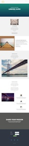

# 引導式登錄頁面範本清單 {#guided-landing-page-template-list}

瀏覽範例範本的集合，以便與 [引導式登錄頁面編輯器](/help/marketo/product-docs/demand-generation/landing-pages/guided-landing-pages/create-a-guided-landing-page.md). 每個範本都完全回應，且以Bootstrap架構為基礎。

>[!NOTE]
>
>Marketo支援未設定來協助疑難排解HTML。 如果您需要修改這些範本的任何協助，請洽詢網頁開發人員。

若要將範本匯入Marketo:

1. 按一下大型檢視的範本名稱。
1. 下載所選的範本。
1. 在Marketo中，導覽至 **設計工作室。**
1. 按一下 **登錄頁面** 在左側樹中，然後選取 **範本。**

1. 在功能表列中，按一下 **匯入範本。**
1. 選擇下載的檔案，輸入模板名稱，然後按一下 **匯入** (請務必挑選描述性名稱，並指出編輯模式為 **引導**)。

|  |  |  |
|---|---|---|
| [範本1A](guided-landing-page-templates/template-1a.md) | [模板1B](guided-landing-page-templates/template-1b.md) | [模板1C](guided-landing-page-templates/template-1c.md) |
|  |  |  |
| [模板1D](guided-landing-page-templates/template-1d.md) | [模板1E](guided-landing-page-templates/template-1e.md) | [範本1F](guided-landing-page-templates/template-1f.md) |
|  |  |  |
| [範本2A](guided-landing-page-templates/template-2a.md) | [模板2B](guided-landing-page-templates/template-2b.md) | [模板2C](guided-landing-page-templates/template-2c.md) |
|  |  |  |
| [模板2D](guided-landing-page-templates/template-2d.md) | [範本3A](guided-landing-page-templates/template-3a.md) | [模板3B](guided-landing-page-templates/template-3b.md) |
|  |  |  |
| [模板3C](guided-landing-page-templates/template-3c.md) | [模板3D](guided-landing-page-templates/template-3d.md) | [範本4A](guided-landing-page-templates/template-4a.md) |
|  |  |  |
| [模板4B](guided-landing-page-templates/template-4b.md) | [模板4C](guided-landing-page-templates/template-4c.md) | [範本5A](guided-landing-page-templates/template-5a.md) |
|  |  |  |
| [模板5B](guided-landing-page-templates/template-5b.md) | [模板5C](guided-landing-page-templates/template-5c.md) | [模板5D](guided-landing-page-templates/template-5d.md) |
|  |  |  |
| [模板5E](guided-landing-page-templates/template-5e.md) | [範本6A](guided-landing-page-templates/template-6a.md) | [模板6B](guided-landing-page-templates/template-6b.md) |
|  |  |  |
| [模板6C](guided-landing-page-templates/template-6c.md) | [模板6D](guided-landing-page-templates/template-6d.md) | [模板6E](guided-landing-page-templates/template-6e.md) |
|  |  |  |
| [模板7A](guided-landing-page-templates/template-7a.md) | [模板7B](guided-landing-page-templates/template-7b.md) | [模板7C](guided-landing-page-templates/template-7c.md) |
|  |  |  |
| [模板7D](guided-landing-page-templates/template-7d.md) | [模板7E](guided-landing-page-templates/template-7e.md) | [模板7F](guided-landing-page-templates/template-7f.md) |
|  |  |  |
| [模板8A](guided-landing-page-templates/template-8a.md) | [模板8B](guided-landing-page-templates/template-8b.md) | [模板8C](guided-landing-page-templates/template-8c.md) |
|  |  |  |
| [模板8D](guided-landing-page-templates/template-8d.md) | [模板8E](guided-landing-page-templates/template-8e.md) | [模板8F](guided-landing-page-templates/template-8f.md) |
|  |  |  |
| [模板8G](guided-landing-page-templates/template-8g.md) | [模板9A](guided-landing-page-templates/template-9a.md) | [模板9B](guided-landing-page-templates/template-9b.md) |
|  |  |  |
| [模板9C](guided-landing-page-templates/template-9c.md) | [模板9D](guided-landing-page-templates/template-9d.md) | [模板9E](guided-landing-page-templates/template-9e.md) |
|  |  |  |
| [模板9F](guided-landing-page-templates/template-9f.md) | [模板10A](guided-landing-page-templates/template-10a.md) | [模板10B](guided-landing-page-templates/template-10b.md) |
|  |  |  |
| [模板10C](guided-landing-page-templates/template-10c.md) | [模板10D](guided-landing-page-templates/template-10d.md) | [模板10E](guided-landing-page-templates/template-10e.md) |
|  |  |  |
| [模板10F](guided-landing-page-templates/template-10f.md) | [模板11A](guided-landing-page-templates/template-11a.md) | [模板11B](guided-landing-page-templates/template-11b.md) |
|  |  |  |
| [模板11C](guided-landing-page-templates/template-11c.md) | [模板11D](guided-landing-page-templates/template-11d.md) | [模板11E](guided-landing-page-templates/template-11e.md) |
|  |  |  |
| [模板11F](guided-landing-page-templates/template-11f.md) | [模板12A](guided-landing-page-templates/template-12a.md) | [模板12B](guided-landing-page-templates/template-12b.md) |
|  |  |  |
| [模板12C](guided-landing-page-templates/template-12c.md) | [模板12D](guided-landing-page-templates/template-12d.md) | [模板12E](guided-landing-page-templates/template-12e.md) |
|  |  |  |
| [模板12F](guided-landing-page-templates/template-12f.md) | [模板13A](guided-landing-page-templates/template-13a.md) | [模板13B](guided-landing-page-templates/template-13b.md) |
|  |  |  |
| [模板13C](guided-landing-page-templates/template-13c.md) | [模板13D](guided-landing-page-templates/template-13d.md) | [模板13E](guided-landing-page-templates/template-13e.md) |
|  |  |  |
| [模板14A](guided-landing-page-templates/template-14a.md) | [模板14B](guided-landing-page-templates/template-14b.md) | [模板14C](guided-landing-page-templates/template-14c.md) |
|  |  |  |
| [模板14D](guided-landing-page-templates/template-14d.md) | [模板14E](guided-landing-page-templates/template-14e.md) | [模板15A](guided-landing-page-templates/template-15a.md) |
|  |  |  |
| [模板15B](guided-landing-page-templates/template-15b.md) | [模板15C](guided-landing-page-templates/template-15c.md) | [模板15D](guided-landing-page-templates/template-15d.md) |
|  |  |  |
| [模板15E](guided-landing-page-templates/template-15e.md) | [模板16A](guided-landing-page-templates/template-16a.md) | [模板16B](guided-landing-page-templates/template-16b.md) |
|  |  |  |
| [模板16C](guided-landing-page-templates/template-16c.md) | [模板16D](guided-landing-page-templates/template-16d.md) | [模板16E](guided-landing-page-templates/template-16e.md) |
|  |  |  |
| [模板17A](guided-landing-page-templates/template-17a.md) | [模板17B](guided-landing-page-templates/template-17b.md) | [模板17C](guided-landing-page-templates/template-17c.md) |
|  |  |  |
| [模板17D](guided-landing-page-templates/template-17d.md) | [模板17E](guided-landing-page-templates/template-17e.md) | [模板18A](guided-landing-page-templates/template-18a.md) |
|  |  |  |
| [模板18B](guided-landing-page-templates/template-18b.md) | [模板18C](guided-landing-page-templates/template-18c.md) | [模板18D](guided-landing-page-templates/template-18d.md) |
|  |  |  |
| [模板18E](guided-landing-page-templates/template-18e.md) | [模板19A](guided-landing-page-templates/template-19a.md) | [模板19B](guided-landing-page-templates/template-19b.md) |
|  |  |  |
| [模板19C](guided-landing-page-templates/template-19c.md) | [模板19D](guided-landing-page-templates/template-19d.md) | [模板19E](guided-landing-page-templates/template-19e.md) |
|  |  |  |
| [模板20A](guided-landing-page-templates/template-20a.md) | [模板20B](guided-landing-page-templates/template-20b.md) | [模板20C](guided-landing-page-templates/template-20c.md) |
|  |  |  |
| [模板20D](guided-landing-page-templates/template-20d.md) | [模板20E](guided-landing-page-templates/template-20e.md) |  |
|  |  |  |
