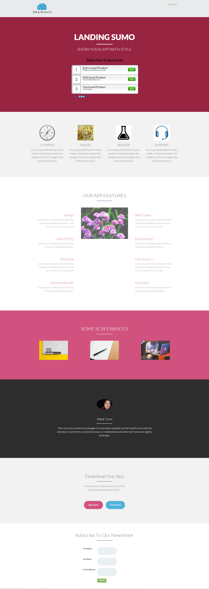

# 範本 14C {#template-14c}

按一下滑鼠右鍵以[下載範本14C](https://51837-micrositemarketo.adobeio-static.net/lp-templates/template-14c.html)

此範本包含下列內容：

* 標題（選用）
* 主要區段

  * 包含主圖示題、主圖文字和調查

* FiBody區段（選擇性）
* 頁尾（選擇性）

**在下方按一下滑鼠右鍵以下載此範本：**

[範本14C.html](https://51837-micrositemarketo.adobeio-static.net/lp-templates/template-14c.html)
