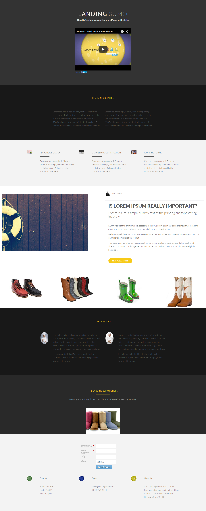

# 模板19B {#template-19b}

[下載模板19B](https://experienceleague.adobe.com/landing/marketo/lp-templates/template-19b.html)

此範本包含下列內容：

* 主要區段

   * 包含主表徵圖題、主圖文字和主圖影片

* 5個內文部分（可選）
* 頁尾（選用）

**按一下以下載此範本：**

[模板19B.html](https://experienceleague.adobe.com/landing/marketo/lp-templates/template-19b.html)
