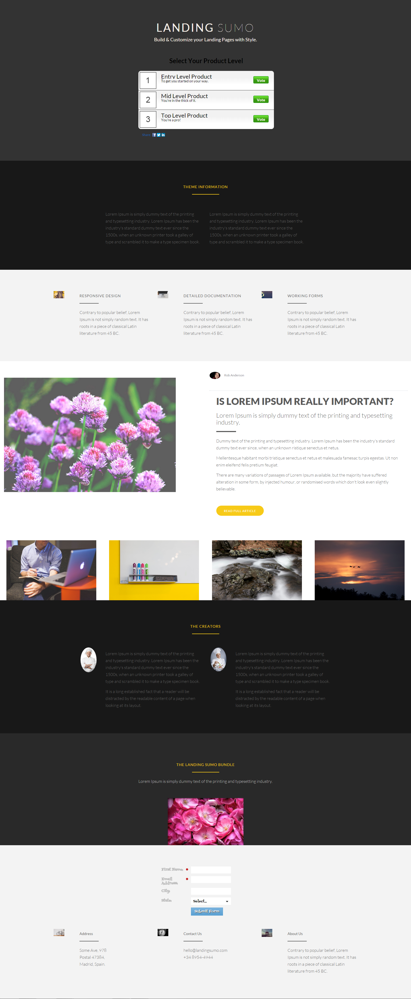

# 範本 19C {#template-19c}

按一下滑鼠右鍵以[下載範本19C](https://experienceleague.adobe.com/landing/marketo/lp-templates/template-19c.html)

此範本包含下列內容：

* 主要區段

   * 包括主圖示題、主圖文字、主圖投票

* 五個內文區段（選擇性）
* 頁尾（選擇性）

**在下方按一下滑鼠右鍵以下載此範本：**

[範本19C.html](https://experienceleague.adobe.com/landing/marketo/lp-templates/template-19c.html)
