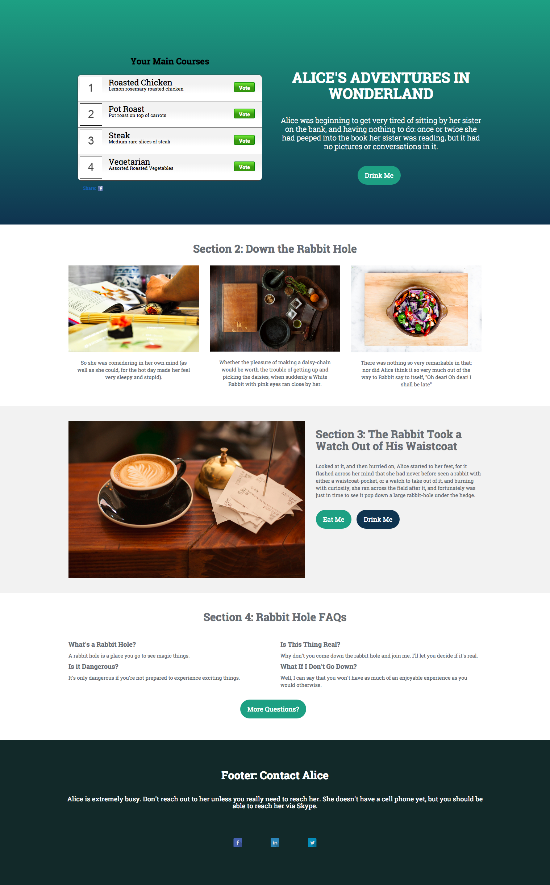

# 範本 1D {#template-1d}

按一下滑鼠右鍵以[下載範本1D](https://experienceleague.adobe.com/landing/marketo/lp-templates/template-1d.html)

此範本包含下列內容：

* 主要區段

   * 包括投票、標題、內文和按鈕。

* 三個主體區段（選擇性）
* 頁尾（選擇性）

**在下方按一下滑鼠右鍵以下載此範本：**

[Template1 1D.html](https://experienceleague.adobe.com/landing/marketo/lp-templates/template-1d.html)
