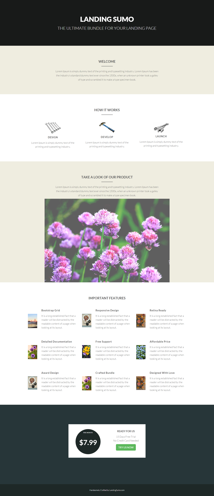

# 範本20-A {#template-a}

[下載範本20-A](http://docs.marketo.com/download/attachments/10092905/template-20a.html?version=1&amp;modificationdate=1441750550000&amp;api=v2)

此範本包含下列內容：

* 主要部分

   * 包含英雄標題和英雄文字

* 四個主體部分（可選）
* 頁尾（選用）

按一下下方以下載此範本：

[Template20-A.html](http://docs.marketo.com/download/attachments/10092905/template-20a.html?version=1&amp;modificationdate=1441750550000&amp;api=v2)
