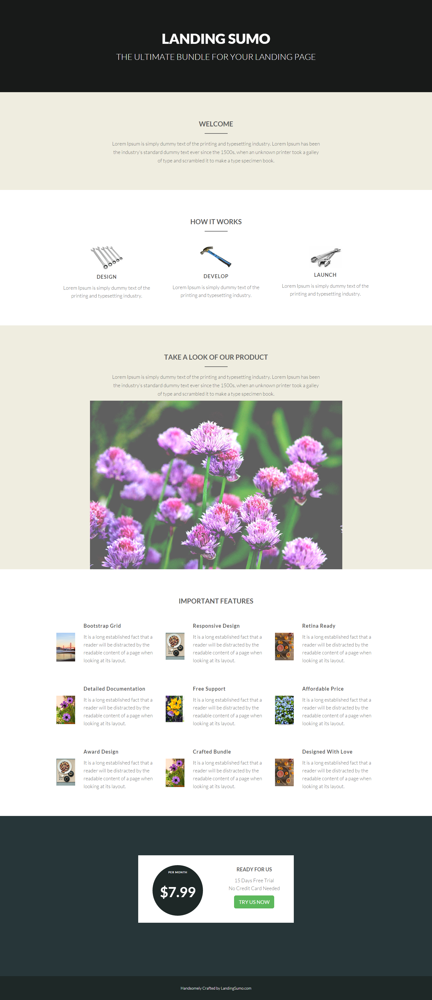

# 範本 20A {#template-20a}

按一下滑鼠右鍵以[下載範本20A](https://experienceleague.adobe.com/landing/marketo/lp-templates/template-20a.html?lang=zh-Hant)

此範本包含下列內容：

* 主要區段

   * 包含主圖示題和主圖文字

* 四個主體區段（選擇性）
* 頁尾（選擇性）

**在下方按一下滑鼠右鍵以下載此範本：**

[範本20A.html](https://experienceleague.adobe.com/landing/marketo/lp-templates/template-20a.html?lang=zh-Hant)
