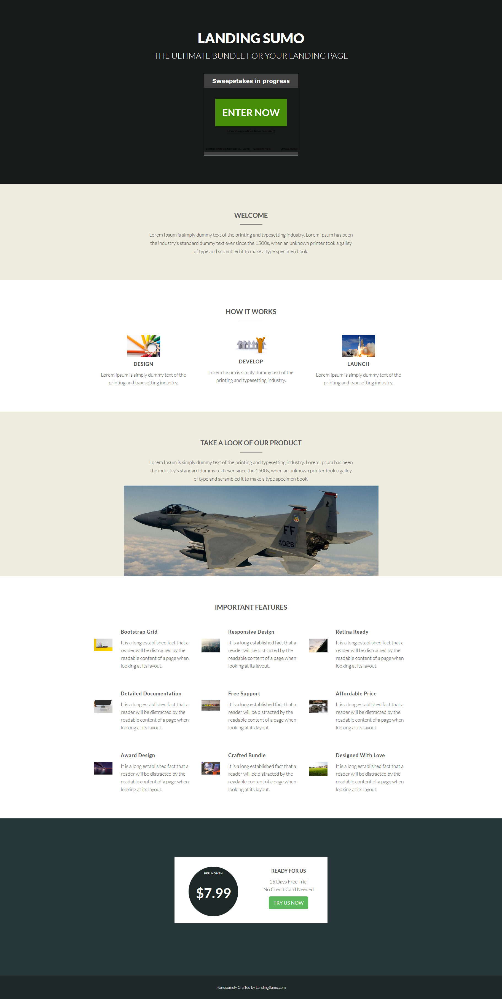

# 範本 20D {#template-20d}

按一下滑鼠右鍵以[下載範本20D](https://51837-micrositemarketo.adobeio-static.net/lp-templates/template-20d.html)

此範本包含下列內容：

* 主要區段

  * 包括英雄抽獎和文字

* 四個主體區段（選擇性）
* 頁尾（選擇性）

**在下方按一下滑鼠右鍵以下載此範本：**

[範本20D.html](https://51837-micrositemarketo.adobeio-static.net/lp-templates/template-20d.html)
