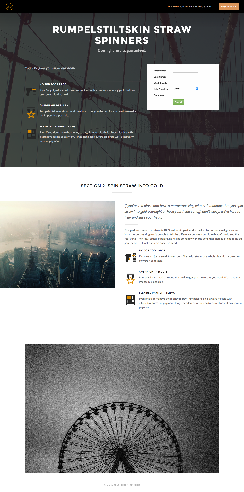

# 範本2A {#template-2a}

按一下右鍵以 [下載範本2A](https://experienceleague.adobe.com/landing/marketo/lp-templates/template-2a.html)

此範本包含下列內容：

* 標題及標誌和按鈕（可選）
* 主要區段

   * 包括主圖背景影像、標題、標線、項目符號清單和表單。

* 一個內文部分（可選）
* 頁尾（選用）

**按一下右鍵以下載此模板：**

[範本2A.html](https://experienceleague.adobe.com/landing/marketo/lp-templates/template-2a.html)
