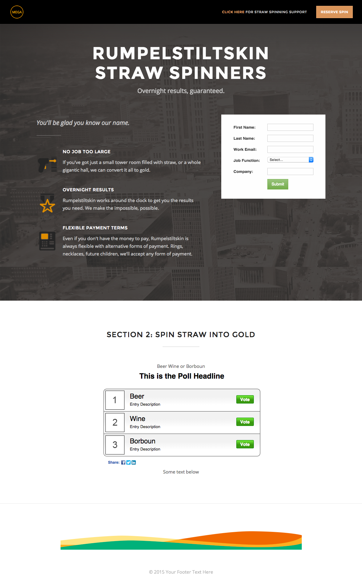

# 範本 2D {#template-2d}

按一下滑鼠右鍵以[下載範本2D](https://experienceleague.adobe.com/landing/marketo/lp-templates/template-2d.html)

此範本包含下列內容：

* 具有標誌和按鈕的頁首（選擇性）
* 主要區段

   * 包括主圖背景影像、標題、標語、專案符號清單和表單。

* 包含文字和輪詢的單一內文區段（選擇性）
* 頁尾（選擇性）

**在下方按一下滑鼠右鍵以下載此範本：**

[範本2D.html](https://experienceleague.adobe.com/landing/marketo/lp-templates/template-2d.html)
