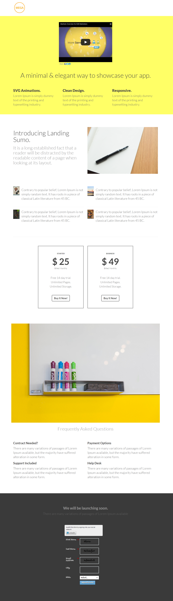

# 範本5B {#template-5b}

按一下滑鼠右鍵以 [下載範本5B](https://experienceleague.adobe.com/landing/marketo/lp-templates/template-5b.html)

此範本包含下列內容：

* 標題（選用）
* 主要區段

   * 包括主圖示題和主圖文字。

* 五個內文區段（選擇性）
* 頁尾（選擇性）

**在下方按一下滑鼠右鍵以下載此範本：**

[範本5B.html](https://experienceleague.adobe.com/landing/marketo/lp-templates/template-5b.html)
