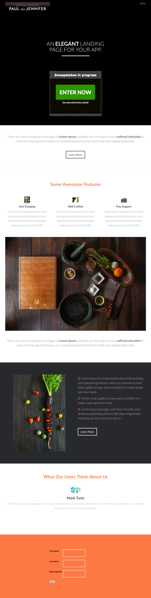

# 範本 7E {#template-7e}

按一下滑鼠右鍵以[下載範本7E](https://51837-micrositemarketo.adobeio-static.net/lp-templates/template-7e.html)

此範本包含下列內容：

* 標題（選用）
* 主要區段

  * 包含頁首與抽獎活動

* 四個主體區段（選擇性）
* 頁尾（選填）

**在下方按一下滑鼠右鍵以下載此範本：**

[範本7E.html](https://51837-micrositemarketo.adobeio-static.net/lp-templates/template-7e.html)
