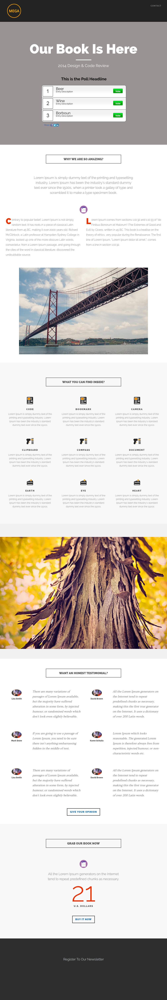

# 範本 8D {#template-8d}

用滑鼠右鍵按一下[下載範本8D](https://51837-micrositemarketo.adobeio-static.net/lp-templates/template-8d.html)並選取&#x200B;**另存連結……**

>[!NOTE]
>
>如需有關如何下載及匯入範本[的完整步驟，請參閱此處](/help/marketo/product-docs/demand-generation/landing-pages/landing-page-templates/guided-landing-page-template-list.md#how-to-import){target="_blank"}。

此範本包含下列內容：

* 標題（選用）
* 主要區段

  * 包含英雄標題、英雄文字和投票

* 五個內文區段（選擇性）
* 頁尾（選填）

**在下方按一下滑鼠右鍵（並選取&#x200B;_另存連結……_） 若要下載此範本：**

[範本8D.html](https://51837-micrositemarketo.adobeio-static.net/lp-templates/template-8d.html)
