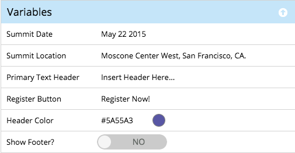

# 瞭解引導範本中的元素和變數 {#understanding-elements-and-variables-in-guided-templates}

引導式著陸頁面範本有兩種類型的可編輯區段：元素和變數。

## 元素  {#elements}

元素是組成著陸頁面的不同內容片段。 它們可以是影像、文字或Marketo資產。

當您編輯引導式著陸頁面時，如果元素已在範本中標示為可編輯，就會顯示這些元素。 元素將具有下列圖示：

*  像
* Marketo Form
* 字
* 訊
* Marketo Share按鈕
* Marketo民調問答
* Marketo Referral
* Marketo Sweepstakes
* Marketo程式碼片段

變數

變數是類似Token的屬性，可從引導式著陸頁面編輯器自訂，如下所示。

變數有三種類型：字串變數、顏色變數和布林變數。

<table> 
 <tbody> 
  <tr> 
   <td>字串</td> 
   <td>
可編輯的文字

範例：標題、日期、按鈕標籤
</td> 
  </tr> 
  <tr> 
   <td>顏色</td> 
   <td>
可編輯的色彩十六進位程式碼

範例：背景顏色、字型顏色、邊框顏色
</td> 
  </tr> 
  <tr> 
   <td>布林值</td> 
   <td>
控制著陸頁面上物件或格式開／關狀態的拉桿

範例：顯示頁尾（是／否）、欄計數(1/2)、內嵌Google Analytics（真／假）
</td> 
  </tr> 
 </tbody> 
</table>

>[!NOTE]
>
>**相關文章**
>
>[建立引導式著陸頁面範本](create-a-guided-landing-page-template.md)

