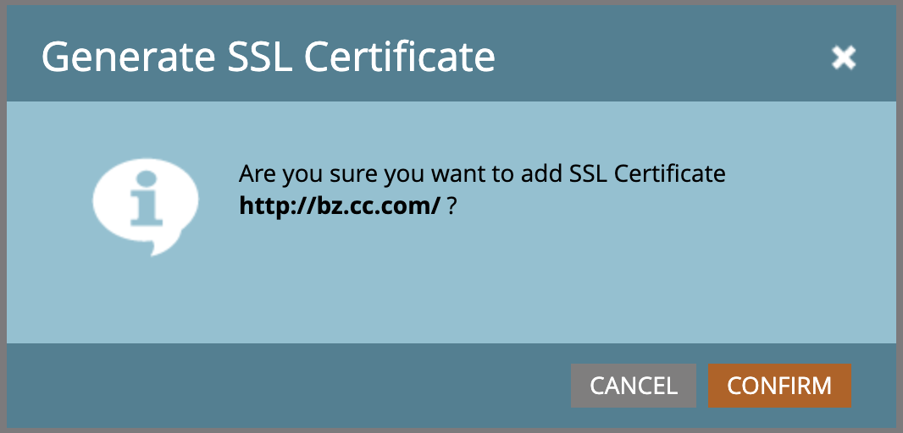

# 新增 SSL 至您的登陸頁面 {#add-ssl-to-your-landing-pages}

SSL （安全通訊端層）加密可讓您保護Marketo Engage執行個體所有登陸頁面的安全。

填寫網頁表單或造訪Marketo Engage託管的登陸頁面時，系統會依預設透過非安全通訊協定(HTTP)傳送資訊。 根據貴公司的原則，您可能想要保護透過(HTTPS)提交給Marketo的資訊。 例如，當您造訪`http://info.mydomain.com/`時，它將是`https://info.mydomain.com/`。

根據預設，Marketo Engage會透過不安全的HTTP通訊協定，追蹤「造訪的網頁」和「點按網頁上的連結」。 如果您想要使用自己的憑證來保護您的追蹤連結，您需要讓Marketo建置單獨的非共用伺服器來啟用它。 為了確保連絡人與您互動的各個層面安全，通常需要同時保護登陸頁面和追蹤連結。

>[!IMPORTANT]
>
>在新增SSL之前，請務必檢視您的合約，以瞭解允許新增的網域總數。 否則，您可能需要支付相關費用。 如果找不到相關資訊，請洽詢Adobe客戶團隊（您的客戶經理）以取得詳細資料。

## 啟用SSL認證 {#enable-ssl-certification}

針對您建立的所有網域別名自動新增SSL，以做為登陸頁面規則的一部分。

1. 移至&#x200B;**管理員**&#x200B;區域。

   

1. 從樹狀結構中選取&#x200B;**登陸頁面**。 在&#x200B;**規則**&#x200B;標籤中，按一下&#x200B;**新增**&#x200B;下拉式清單，然後選取&#x200B;**新增網域別名**。

   

1. 輸入您的&#x200B;_網域別名_&#x200B;和&#x200B;_預設頁面_。 選取&#x200B;**產生SSL憑證**&#x200B;核取方塊。 完成時，按一下&#x200B;**建立**。

   

這會自動為此網域新增SSL憑證。

## 為您的預設網域啟用SSL {#enable-ssl-default-domain}

請依照下列步驟，為您的預設網域啟用SSL。

1. 仍然在&#x200B;**管理員**&#x200B;區段中，選取&#x200B;**登陸頁面**。 按一下&#x200B;**設定**&#x200B;旁的橘色&#x200B;_編輯_&#x200B;按鈕。

   {width="800" zoomable="yes"}

   >[!NOTE]
   >
   >如有需要，您也可以在此處修改網域名稱（需要有效的網域）。

1. 選取「產生SSL憑證」核取方塊，然後按一下「儲存」。

   

>[!NOTE]
>
>SSL可能最多需要三分鐘的時間才會處於「就緒」狀態。 重新整理頁面以顯示變更。

## 編輯SSL到現有的網域別名

請依照下列步驟，為您現有的網域別名啟用SSL。

1. 從&#x200B;_[!UICONTROL Admin]_&#x200B;區域，展開左側導覽中的&#x200B;**[!UICONTROL Integration]**&#x200B;並選取&#x200B;**[!UICONTROL Landing Pages]**。

1. 在頁面上，選取頂端的&#x200B;**[!UICONTROL Rules]**&#x200B;索引標籤。

1. 選取您要編輯的網域別名列，然後按一下頂端的&#x200B;**[!UICONTROL Add SSL]**。

   {width="800" zoomable="yes"}

1. 在對話方塊中，按一下&#x200B;**[!UICONTROL Confirm]**。

   {width="400"}

>[!NOTE]
>
>SSL可能最多需要三分鐘的時間才會處於「就緒」狀態。 重新整理頁面以顯示變更。

## 錯誤訊息 {#error-messages}

在下方，您會找到您可能收到的錯誤訊息及其定義。

<table><thead>
  <tr>
    <th>錯誤</th>
    <th>詳細資料</th>
  </tr></thead>
<tbody>
<tr>
    <td><i>網域已經存在。</i></td>
    <td>已有相同名稱的網域存在。</td>
  </tr>
  <tr>
    <td><i>網域未對應到預設網域。</i></td>
    <td>自訂網域未正確對應到預設網域。 請驗證網域對應設定，並確定DNS設定指向正確的預設網域。</td>
  </tr>
  <tr>
    <td><i>因為不支援的CAA記錄，所以無法發行SSL憑證。 請要求您的IT更新您的CAA記錄。</i></td>
    <td>CAA記錄不是最新的。 若是使用Marketo Engage管理的SSL憑證，CAA記錄需要更新為供應商建議的憑證。 請聯絡您的IT部門以更新CAA記錄。 如需其他詳細資訊，請參閱<a href="https://nation.marketo.com/t5/product-blogs/changes-to-marketo-engage-secured-domains-platform/ba-p/329305#M2246">此頁面</a>。</td>
  </tr>
  <tr>
    <td><i>SSL憑證已發行。</i></td>
    <td>此自訂網域已存在SSL憑證。 除非憑證已過期或需要重新核發，否則不需要進一步動作。</td>
  </tr>
  <tr>
    <td><i>找不到預設網域。 請聯絡支援以尋求協助。</i></td>
    <td>嘗試尋找預設網域時發生問題。 請洽詢支援人員，以便他們進行調查。</td>
  </tr>
  <tr>
    <td><i>建立網域時遇到未預期的錯誤。 請聯絡支援以尋求協助。</i></td>
    <td>發生非預期的錯誤。 請收集記錄檔和錯誤詳細資料，並將問題升級至<a href="https://nation.marketo.com/t5/support/ct-p/Support" target="_blank">Marketo支援</a>。</td>
  </tr>
</tbody></table>

## 注意事項 {#things-to-note}

* **網域與Marketo Engage的DNS對應**：在UI中新增網域之前，您必須[將CNAME對應到Marketo提供的網域](https://experienceleague.adobe.com/zh-hant/docs/marketo/using/getting-started/initial-setup/setup-steps#customize-your-landing-page-urls-with-a-cname){target="_blank"}。

* **自訂SSL**：如果您需要自訂SSL，請提交[支援票證](https://nation.marketo.com/t5/support/ct-p/Support){target="_blank"}。 請勿使用自助核取方塊來建立SSL。

* **預先存在的SSL**：新增網域時，系統會檢查預先存在的SSL （可能之前已手動建立）。 如果您遇到此驗證，請在不選取SSL建立的情況下建立您的網域，我們會為您連線。 [連絡支援人員](https://nation.marketo.com/t5/support/ct-p/Support){target="_blank"}更多詳細資料/選項。

* **刪除網域**：自動刪除網域&#x200B;**不會**&#x200B;刪除SSL憑證。 此護欄可防止使用者發生導致網站沒有SSL憑證的錯誤。 如果您確實要移除SSL憑證，[請連絡支援](https://nation.marketo.com/t5/support/ct-p/Support){target="_blank"}。
