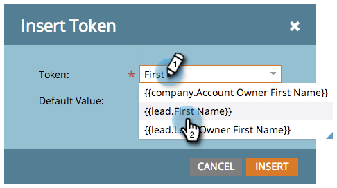

# 新增文字和Token至著陸頁面{#add-text-and-tokens-to-a-landing-page}

>[!NOTE]
>
>Marketo登陸頁面僅支援Token。

## 將Rich Text新增至著陸頁面{#add-rich-text-to-your-landing-page}

1. 選擇您的登陸頁面，然後按一下「編輯草稿」。****

   

   >[!NOTE]
   >
   >著陸頁面設計工具會在新視窗中開啟。

1. 拖曳至&#x200B;**Rich Text**&#x200B;元素上。

   

1. 輸入所要的文字，然後按一下「儲存」。****

   

既然您已瞭解如何新增文字至著陸頁面，我們就開始使用新增Token。

## 新增Token至您的著陸頁面{#add-a-token-to-your-landing-page}

Token是動態文字片段，可個人化您的登陸頁面。

>[!TIP]
>
>像名字這樣的東西來自人物記錄。 其他預付碼來自程式中的「我的預付碼」索引標籤。

1. 選擇您的登陸頁面，然後按一下「編輯草稿」。****

   

   >[!NOTE]
   >
   >著陸頁面設計工具會在新視窗中開啟。

1. 連按兩下您要新增Token的Rich Text方塊。

   

1. 按一下「插入Token」圖示。

   

1. 尋找並選取您選擇的Token。

   

1. 輸入&#x200B;**預設值** ，然後按一下&#x200B;**插入**。

   

1. 按一下&#x200B;**保存**。

   

   任務完成！ 您現在的登陸頁面上有Token。
