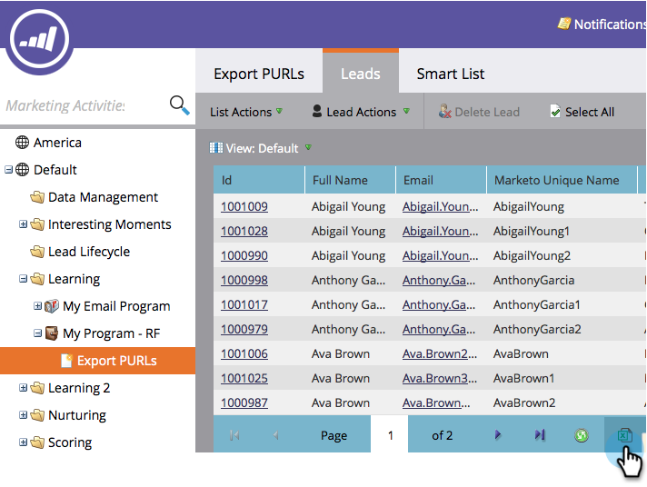
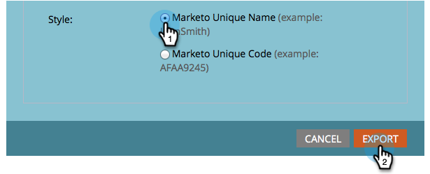

# 匯出包含個人化URL的清單 {#export-a-list-with-personalized-urls}

>[!PREREQUISITES]
>
>* [為您的帳戶啟用個人化URL](/help/marketo/product-docs/demand-generation/landing-pages/personalizing-landing-pages/enable-personalized-urls-for-your-account.md)
>* [為登陸頁面啟用個人化URL](/help/marketo/product-docs/demand-generation/landing-pages/personalizing-landing-pages/enable-personalized-urls-for-a-landing-page.md)

1. 選取您的清單或智慧清單，按一下 **銷售機會** 標籤以取得結果，然後按一下excel圖示。 內嵌確認您擁有 **Marketo唯一代碼** 和 **Marketo唯一名稱** [欄可見](/help/marketo/product-docs/core-marketo-concepts/smart-lists-and-static-lists/using-smart-lists/create-and-change-views-for-lists-and-smart-list.md).

   

1. Check **包含個人化URL**，尋找並選取您要產生PURL的登陸頁面。

   

1. 選取 **URL**.

   

   >[!TIP]
   >
   >如果您看到同一登陸頁面有多個URL，很可能是因為您在過去的某個時間點變更了頁面URL並建立了一個重新導向。

1. 選擇 **樣式** 並按一下 **匯出**.

   

1. 匯出完成時，按一下 **立即下載** 儲存檔案的連結。

   

   而且您已完成！ 您現在擁有銷售機會清單和個人化URL。

   

   >[!NOTE]
   >
   >如果有具有相同名字和姓氏的潛在客戶，系統會自動附加數字以確保URL保持唯一。
