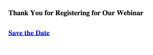

# 在登陸頁面中加入行事曆事件 ICS 檔案 {#include-a-calendar-event-ics-file-in-a-landing-page}

**[!UICONTROL Calendar File]** Token可讓您將行事曆事件(.ics)連結新增至您的Marketo登陸頁面。

>[!PREREQUISITES]
>
>* [建立行事曆事件(.ics)檔案](/help/marketo/product-docs/email-marketing/general/functions-in-the-editor/create-a-calendar-event-ics-file.md)

1. 在您的登入頁面編輯器中，按一下&#x200B;**{...}**&#x200B;以插入權杖。

   

1. 選取&#x200B;**[!UICONTROL Calendar File]**&#x200B;權杖並按一下&#x200B;**[!UICONTROL Insert]**。

   >[!CAUTION]
   >
   >登陸頁面不支援下列權杖：
   >
   >* member.webinar URL

   

1. 按一下「**[!UICONTROL Save]**」。

   使用者會看到如下所示的登陸頁面：

   

在核准登入頁面之前，請務必先測試行事曆連結。

>[!MORELIKETHIS]
>
>[在電子郵件中包含行事曆事件(.ics)](/help/marketo/product-docs/email-marketing/general/functions-in-the-editor/include-a-calendar-event-ics-in-an-email.md)
