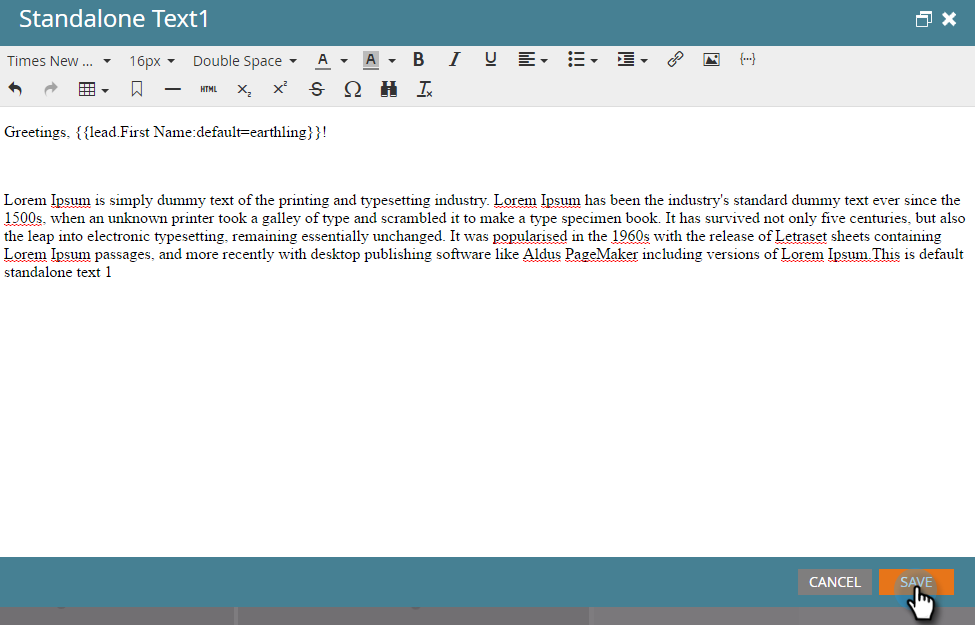

# Token概述 {#tokens-overview}

代號是變數，可用於Marketo智慧型促銷活動流程步驟、電子郵件、登錄頁面、片段和網頁促銷活動。

## 了解預設值 {#understanding-default-values}

使用代號時，您也想要提供預設值。 這是顯示人員是否沒有您參考之欄位值的文字。

在此範例中，電子郵件會顯示「Greetings，（名字）」或「Greetings, earthling」（預設值）。

>[!CAUTION]
>
>使用Marketo的電子郵件編輯器時，代號無法在前置標題中運作。 若要在preheader中使用代號，必須透過您在電子郵件範本中的專屬HTML。

>[!NOTE]
>
>這份清單並非詳盡無遺。 系統也會為您在Marketo中擁有的每個自訂欄位建立代號。

## 人員代號 {#person-tokens}

* `{{lead.Acquisition Date}}`
* `{{lead.Acquisition Program Name}}`
* `{{lead.Acquisition Program}}`
* `{{lead.Address}}`
* `{{lead.Anonymous IP}}`
* `{{lead.Black Listed}}`
* `{{lead.City}}`
* `{{lead.Country}}`
* `{{lead.Created At}}`
* `{{lead.Date of Birth}}`
* `{{lead.Department}}`
* `{{lead.Do Not Call}}`
* `{{lead.Do Not Call Reason}}`
* `{{lead.Email Address}}`
* `{{lead.Email Invalid}}`
* `{{lead.Email Invalid Cause}}`
* `{{lead.Fax Number}}`
* `{{lead.First Name}}`
* `{{lead.Full Name}}`
* `{{lead.Id}}`
* `{{lead.Inferred City}}`
* `{{lead.Inferred Company}}`
* `{{lead.Inferred Country}}`
* `{{lead.Inferred Metropolitan Area}}`
* `{{lead.Inferred Phone Area Code}}`
* `{{lead.Inferred Postal Code}}`
* `{{lead.Inferred State Region}}`
* `{{lead.Is Customer}}`
* `{{lead.Is Employee}}`
* `{{lead.Is Partner}}`
* `{{lead.Job Title}}`
* `{{lead.Last Name}}`
* `{{lead.Lead Source}}`
* `{{lead.Marketing Suspended}}`
* `{{lead.Middle Name}}`
* `{{lead.Mobile Phone Number}}`
* `{{lead.Original Referrer}}`
* `{{lead.Original Search Engine}}`
* `{{lead.Original Search Phrase}}`
* `{{lead.Original Source Info}}`
* `{{lead.Original Source Type}}`
* `{{lead.Person Notes}}`
* `{{lead.Phone Number}}`
* `{{lead.Registration Source Info}}`
* `{{lead.Registration Source Type}}`
* `{{lead.Salutation}}`
* `{{lead.SFDC Created Date}}`
* `{{lead.SFDC Is Deleted}}`
* `{{lead.SFDC Type}}`
* `{{lead.Unsubscribed}}`
* `{{lead.Unsubscribed Reason}}`
* `{{lead.Updated At}}`
* 如果您使用自訂人員欄位的顯示名稱，例如 `{{lead.Custom Field Name}}`

## 公司代號 {#company-tokens}

* `{{Company.Account Owner Email Address}}`
* `{{Company.Address}}`
* `{{Company.Annual Revenue}}`
* `{{Company.City}}`
* `{{Company.Company Name}}`
* `{{Company.Company Notes}}`
* `{{Company.Country}}`
* `{{Company.Industry}}`
* `{{Company.Main Phone}}`
* `{{Company.Num Employees}}`
* `{{Company.Parent Company Name}}`
* `{{Company.Postal Code}}`
* `{{Company.SFDC Account Num}}`
* `{{Company.SFDC Created Date}}`
* `{{Company.SFDC Type}}`
* `{{Company.SIC Code}}`
* `{{Company.Site}}`
* `{{Company.State}}`
* `{{Company.Website}}`
* 如果您使用自訂公司欄位的顯示名稱（例如），也可使用自訂公司欄位。 `{{Company.Custom Field Name}}`

## 促銷活動代號 {#campaign-tokens}

* `{{campaign.name}}`
* `{{campaign.id}}`
* `{{campaign.description}}`

## 系統代號 {#system-tokens}

>[!NOTE]
>
>請前往 [系統令牌辭匯表](/help/marketo/product-docs/email-marketing/general/using-tokens/system-tokens-glossary.md).

* `{{system.date}}`
* `{{system.time}}`
* `{{system.dateTime}}`
* `{{system.forwardToFriendLink}}`
* `{{system.unsubscribeLink}}`
* `{{system.viewAsWebpageLink}}`

## 觸發Token {#trigger-tokens}

* `{{trigger.Trigger Name}}`
* `{{trigger.Name}}`
* `{{trigger.Link}}`
* `{{trigger.Subject}}`
* `{{trigger.Category}}`
* `{{trigger.Details}}`
* `{{trigger.Web Page}}`
* `{{trigger.Client IP Address}}`
* `{{trigger.Sent By}}`
* `{{trigger.Received By}}`
* `{{trigger.Referrer}}`
* `{{trigger.Search Engine}}`
* `{{trigger.Search Query}}`

>[!NOTE]
>
>查找有關 [有趣時刻的代號](/help/marketo/product-docs/marketo-sales-insight/msi-for-salesforce/features/tabs-in-the-msi-panel/interesting-moments/trigger-tokens-for-interesting-moments.md) 根據智慧型行銷活動中使用的觸發器。

## 程式代號 {#program-tokens}

* `{{program.Name}}`
* `{{program.Description}}`
* `{{program.id}}`

## 我的代號 {#my-tokens}

我的代號是在程式中定義，開頭為 `{{my.` 後跟您為代號建立的名稱。 深入了解 [程式中的代號](/help/marketo/product-docs/core-marketo-concepts/programs/tokens/understanding-my-tokens-in-a-program.md).

## 成員令牌 {#member-token}

會員令牌用於插入來自整合服務合作夥伴的唯一值。 會員代號的常見用法，是供網路研討會與會者使用的唯一URL。 每個人都有一個唯一URL可存取網路研討會，可使用 `{{member.webinar url}}` 代號。 此 `{{member.webinar url}}` token會自動解析服務提供者產生之人員的唯一確認URL。

* `{{member.webinar url}}`

>[!CAUTION]
>
>此 `{{member.webinar url}}` 唯有傳送電子郵件的智慧型行銷活動是事件方案的子資產時，才會填入代號。
