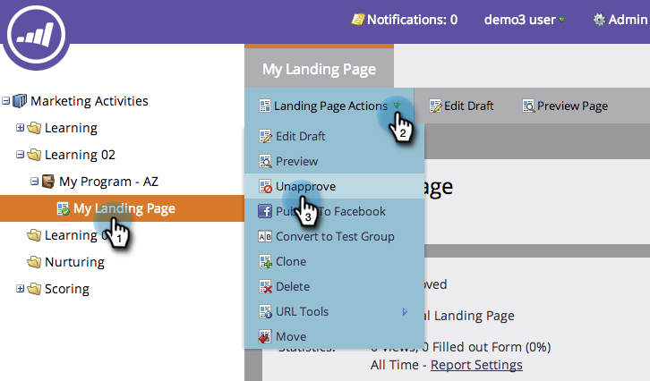

# 批准、取消批准或刪除著陸頁面 {#approve-unapprove-or-delete-a-landing-page}

在您核准著陸頁面之前，著陸頁面會處於草稿模式。 「核准」可讓系統的其餘部分提供頁面。 當您編輯已核准的著陸頁面時，Marketo會儲存草稿，但會繼續使用已核准的版本，直到您核准草稿為止。

## 批准著陸頁面 {#approve-a-landing-page}

1. 選取著陸頁面，前往「著陸頁 **面動作」** ，然後按 **一下「批准」**。

   >[!TIP]
   >
   >您可以 [一次核准多個頁面](../../../../product-docs/demand-generation/landing-pages/landing-page-actions/approve-multiple-landing-pages-at-once.md) ，讓生活更輕鬆。

   

1. 您也可以以滑鼠右鍵按一下著陸頁面，然後按一下「 **核准**」。

   

   >[!NOTE]
   >
   >**提醒**
   >
   >
   >一旦核准後，您的著陸頁面圖示上會有綠色核取標籤。

1. 取消核准著陸頁面
1. 選取著陸頁面，前往「著陸頁 **面動作」** ，然後按一 **下「取消核准」**。

   

1. 您也可以以滑鼠右鍵按一下著陸頁面，然後按一下「取 **消核准**」。

   

>[!NOTE]
>
>您未核准的登陸頁面不再發佈在Web上，不會產生其他活動。 未核准登陸頁面及其Facebook標籤的訪客將會看到「備 [援頁面」](../../../../product-docs/administration/settings/set-a-fallback-page.md)。

## 刪除著陸頁面 {#delete-a-landing-page}

1. 選取著陸頁面，前往「著陸頁 **面動作」** ，然後按一 **下「刪除」**。

   

   >[!NOTE]
   >
   >您無法刪除已核准的登陸頁面。 先取消核准。

1. 您也可以以滑鼠右鍵按一下著陸頁面，然後按一 **下刪除**。

   

## 刪除多個著陸頁面 {#delete-multiple-landing-pages}

想一次刪除多個著陸頁面嗎？ 這是方法。

1. 在Design Studio中，按一下「 **著陸頁面」**。

   

1. 按一下您要刪除的第一個著陸頁面，然後shift+按一下最後一個著陸頁面。

   

   >[!TIP]
   >
   >您也可以使用ctrl+click來刪除多個非循序的著陸頁面。

1. 按一下「 **著陸頁面動作** 」下拉式清單，然後選 **取「刪除」**。

   

1. 按一 **下刪除**。

   

太棒了！ 現在您知道如何核准、取消核准和刪除著陸頁面。
