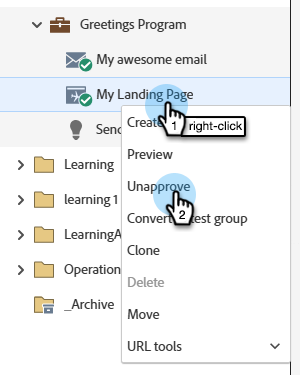
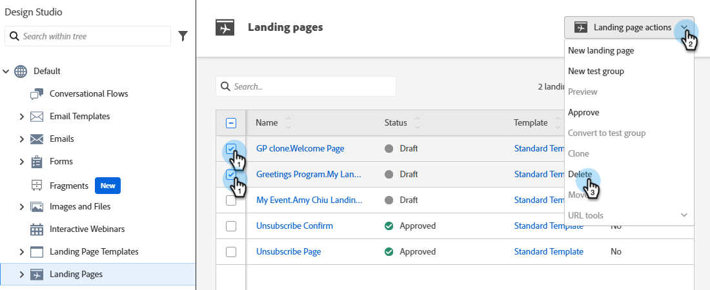

# 核准、取消核准或刪除登陸頁面 {#approve-unapprove-or-delete-a-landing-page}

登入頁面處於草稿模式，直到您核准它們為止。 核准後，頁面便可在系統其他部分使用。 當您編輯已核准的登陸頁面時，Marketo Engage會儲存草稿，但會繼續使用已核准的版本，直到您核准草稿為止。

## 核准登陸頁面 {#approve-a-landing-page}

1. 選取想要的登陸頁面，然後按一下「**[!UICONTROL Approve draft]**」。

   

   >[!TIP]
   >
   >如有需要，您可以一次[核准多個頁面](/help/marketo/product-docs/demand-generation/landing-pages/landing-page-actions/approve-multiple-landing-pages-at-once.md)。

您也可以在左側導覽的登陸頁面上按一下滑鼠右鍵，然後選取&#x200B;**[!UICONTROL Approve]**。

>[!NOTE]
>
>已核准的登陸頁面中新增了綠色核取記號。

## 取消核准登陸頁面 {#unapprove-a-landing-page}

1. 選取想要的登陸頁面，然後按一下&#x200B;**[!UICONTROL Unapprove]**。

   

您也可以在左側導覽的登陸頁面上按一下滑鼠右鍵，然後選取&#x200B;**[!UICONTROL Unapprove]**。

>[!NOTE]
>
>您未核准的登陸頁面將不再發佈在網頁上，且不會產生其他活動。 未核准登陸頁面的訪客及其Facebook標籤將會看到[後援頁面](/help/marketo/product-docs/administration/settings/set-a-fallback-page.md)。

## 刪除登陸頁面 {#delete-a-landing-page}

1. 選取所需的登陸頁面。 按一下&#x200B;**[!UICONTROL Landing Page Actions]**&#x200B;下拉式清單，然後選取&#x200B;**[!UICONTROL Delete]**。

   

   >[!IMPORTANT]
   >
   >您無法刪除核准的登陸頁面。 您必須先取消核准。

您也可以在左側導覽的登陸頁面上按一下滑鼠右鍵，然後選取&#x200B;**[!UICONTROL Delete]**。

## 刪除多個登陸頁面 {#delete-multiple-landing-pages}

1. 在主[!UICONTROL Design Studio]畫面上，按一下&#x200B;**[!UICONTROL Landing Pages]**。

   

1. 選取所需的登陸頁面。 按一下&#x200B;**[!UICONTROL Landing Page Actions]**&#x200B;下拉式清單，然後選取&#x200B;**[!UICONTROL Delete]**。

   

1. 按一下&#x200B;**[!UICONTROL Delete]**&#x200B;確認。

   
