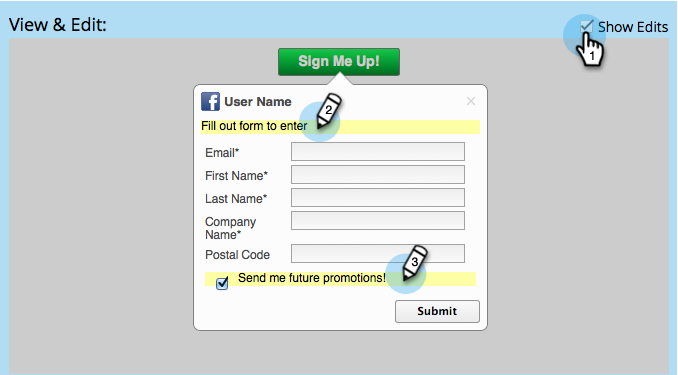

# 設定社交應用程式的個人擷取 {#configure-person-capture-for-a-social-app}

當您建立 [轉介優惠方案](/help/marketo/product-docs/demand-generation/social/referral-offers/create-a-referral-offer.md) 或 [抽獎](/help/marketo/product-docs/demand-generation/social/sweepstakes/create-sweepstakes.md)，您可以設定您向人員要求哪些資訊以及您需要哪些資訊才能參與。

>[!NOTE]
>
>只有在先前未提供此資訊時，才會提示使用者提供此資訊。

1. 前往 **行銷活動**.

   

1. 選取應用程式，然後按一下 **編輯草稿**.

   

1. 在社交應用程式編輯器中，前往 **註冊流程** > **個人擷取**.

   

1. 選取您將要求的資訊，並指明註冊優惠方案所需的欄位。

   

   包含行銷選項：

   * **選擇退出**：預設會訂閱人員。
   * **選擇加入**：個人可以選擇訂閱。

   >[!NOTE]
   >
   >無論哪種方式，參與者仍會收到 [_營運_ 電子郵件](/help/marketo/product-docs/email-marketing/general/functions-in-the-editor/make-an-email-operational.md) 從您的選件中。

1. 在「檢視和編輯」視窗中，按一下 **顯示編輯** 並編輯共用提示中的訊息。

   

>[!MORELIKETHIS]
>
>現在您可以 [設定社交註冊流程](/help/marketo/product-docs/demand-generation/social/configuring-social-actions/configure-social-sign-up-share-flow.md) 並編輯會張貼至每個社交網路的分享訊息。
