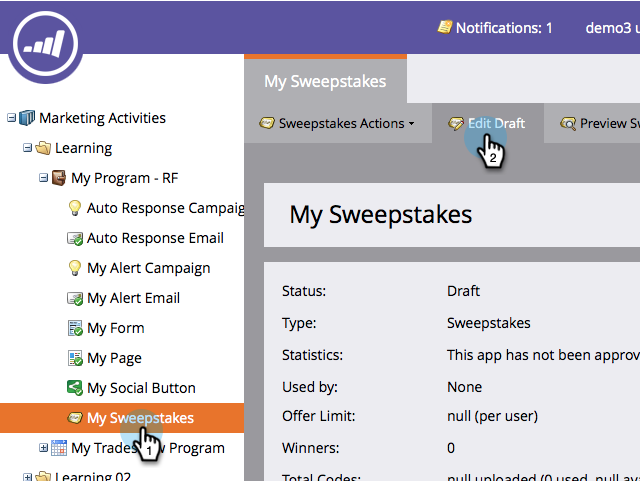
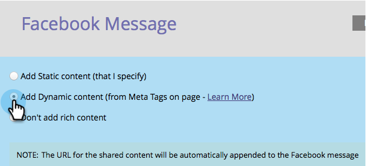
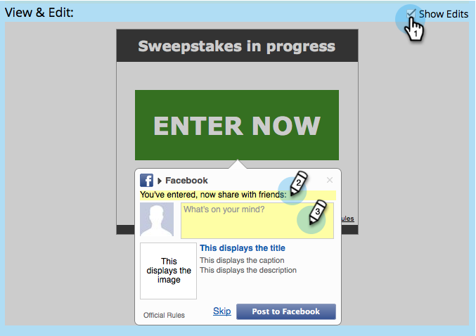

# 設定社交註冊/共用流程 {#configure-social-sign-up-share-flow}

建立社交應用程式時，您可以設定社交網路選項，並在使用者註冊時提示使用者。

## 選取要共用的網路 {#select-networks-for-sharing}

1. 前往 **行銷活動**.

   

1. 選取應用程式，然後按一下 **編輯草稿**.

   

1. 在社交應用程式編輯器中，按一下 **註冊流程** > **社交網路**.

   

1. 選取（或取消選取）個人可以分享的網路。

   

## 設定Facebook訊息 {#configure-the-facebook-message}

1. 前往 **註冊流程** > **共用訊息**.

   

1. 設定將顯示在Facebook貼文中的訊息。

   

   >[!NOTE]
   >
   >在視訊共用中，縮圖會自動產生。

   如果您選擇 **新增動態內容**，則頁面的 **OpenGraph** 標籤（og：title、og：caption和og：description）和縮圖會自動新增到Facebook貼文中。 請參閱下一個步驟。

   如果您選擇 **新增靜態內容**，輸入標題、註解、說明並上傳影像。 請參閱接下來的兩個步驟。

1. 在「檢視和編輯」視窗中，按一下 **顯示編輯** 並編輯將顯示在Facebook貼文中的共用提示和訊息。

   >[!TIP]
   >
   >如需詳細資訊，請參閱 [編輯Facebook Rich Post設定](/help/marketo/product-docs/demand-generation/facebook/edit-facebook-rich-post-settings.md).

   

   >[!NOTE]
   >
   >此 [共用URL](/help/marketo/product-docs/demand-generation/social/social-functions/choose-the-share-url-for-a-social-app.md) 會自動新增至所有共用訊息。

1. 如果您選擇 **新增靜態內容** 在上方編輯標題、註解和說明，並上傳自訂影像(從 [**Marketo影像和檔案**](/help/marketo/product-docs/demand-generation/images-and-files/add-images-and-files-to-marketo.md))。

   

   另請參閱 [將影像和檔案新增至Marketo](/help/marketo/product-docs/demand-generation/images-and-files/add-images-and-files-to-marketo.md).

   >[!NOTE]
   >
   >如果您上傳影像，在關閉並重新開啟社交應用程式編輯器之前，您不會在這裡看到影像。

1. 按一下 **下一個**.

如果您選擇頁面標籤的值（og：title、og：caption和og：description），縮圖會自動新增至Facebook貼文。 請參閱下一個步驟。

## 設定Twitter訊息 {#configure-the-twitter-message}

1. 編輯分享提示和將顯示在Twitter推文中的訊息。

   

   >[!TIP]
   >
   >使用 {html_title} 在推文文字中自動顯示頁面標題。

1. 按一下 **下一個**.

## 設定LinkedIn訊息 {#configure-the-linkedin-message}

1. 設定將顯示在LinkedIn貼文中的訊息。

   

   如果您選擇 **新增動態內容**、頁面標籤的值（標題和說明）和縮圖，會自動新增至LinkedIn貼文。 請參閱下一個步驟。

   如果您選擇 **新增靜態內容**，輸入標題、註解和說明，然後上傳影像。 請參閱接下來的兩個步驟。

1. 在 **檢視和編輯** 視窗，按一下 **顯示編輯** 並編輯將顯示在LinkedIn貼文中的共用提示和訊息。

   

   >[!TIP]
   >
   >使用 {html_title} 在張貼文字中自動顯示頁面標題。

1. 如果您選擇 **新增靜態內容** 編輯標題和說明，然後上傳自訂影像(從 [**Marketo影像和檔案**](/help/marketo/product-docs/demand-generation/images-and-files/add-images-and-files-to-marketo.md))。

   

>[!NOTE]
>
>如果您上傳影像，在關閉並重新開啟社交應用程式編輯器之前，您不會在這裡看到影像。

>[!MORELIKETHIS]
>
>接下來，您可以按一下 **完成** > **核准並關閉** 並將您的社交應用程式放在登陸頁面上。 您也可以設定 [個人擷取](/help/marketo/product-docs/demand-generation/social/configuring-social-actions/configure-person-capture-for-a-social-app.md) 或 [重新共用提示](/help/marketo/product-docs/demand-generation/social/configuring-social-actions/configure-re-share-email-and-prompt-for-a-social-app.md).
