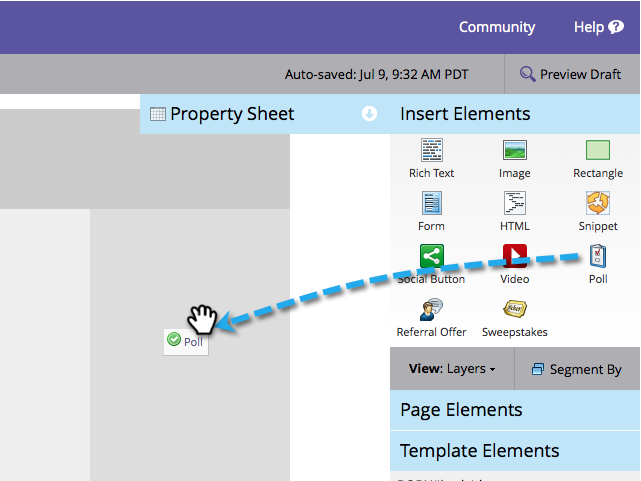

# 發佈投票 {#publish-a-poll}

在您之後 [建立投票](/help/marketo/product-docs/demand-generation/social/creating-a-poll/create-a-poll.md)，您可將它發佈在Marketo登陸頁面、Facebook和網站上。

1. 導覽至您的登入頁面，並開啟它以進行編輯。

   

1. 拖曳到 **輪詢** 從右側的浮動視窗。

   

1. 選取您的投票，然後按一下 **插入**.

   

>[!NOTE]
>
>您需要核准您的投票，才能在這裡使用。

恭喜！核准登入頁面，且您的輪詢為即時進行。 您也可以 [將登入頁面發佈至Facebook](/help/marketo/product-docs/demand-generation/facebook/publish-landing-pages-to-facebook.md) 或 [將意見調查放在您的網站上](/help/marketo/product-docs/demand-generation/social/social-functions/deploy-social-on-your-website.md).

>[!TIP]
>
>測試並調整您的投票。 前往網頁上的投票，並使用測試資訊註冊。 記下您想要變更的所有使用者體驗相關內容。
