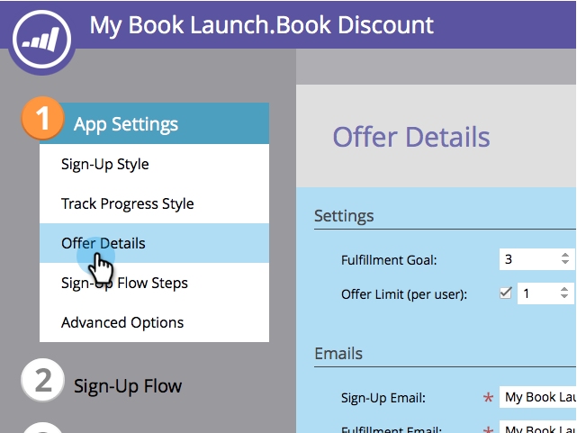
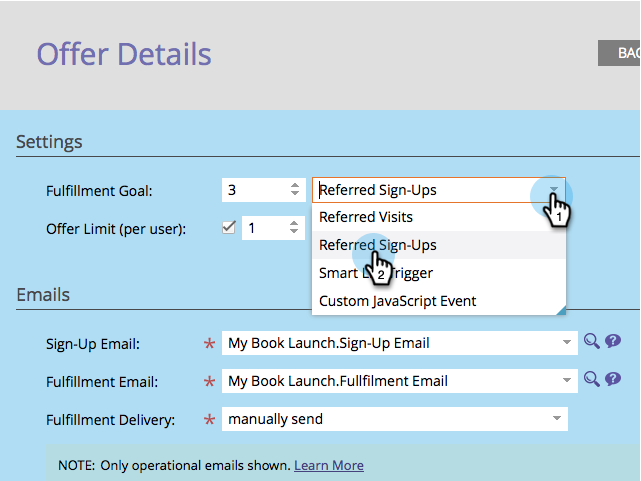

# 指定轉介選件的目標 {#specify-goal-for-referral-offer}

當您 [建立反向連結選件](/help/marketo/product-docs/demand-generation/social/referral-offers/create-a-referral-offer.md)，您必須定義完成目標。 目標可由網頁上的人員活動（例如頁面造訪或註冊）來定義。 您甚至可以使用 [自訂JavaScript事件](/help/marketo/product-docs/demand-generation/social/social-functions/conversion-script-for-custom-events.md).

或者，您也可以在Marketo中使用智慧清單觸發程式，等待任何里程碑，例如為參考人員建立的機會。

範例目標：

* 10次反向瀏覽
* 5個引用註冊
* 已建立1個引用機會
* 2個反向電子商務購買
* 5名引薦的網路研討會與會者

1. 前往 **行銷活動**.

   

1. 選取反向連結選件，然後按一下 **編輯草稿**.

   

1. 在反向連結選件編輯器中，前往 **應用程式設定** > **優惠方案詳細資訊**.

   

1. 在 **設定**，請從 **完成目標** 下拉式清單。

   

>[!TIP]
>
>如果您打算使用 **給予反向連結評分** 流量步驟，您必須選取 **智慧清單觸發器** 作為完成目標類型。

* 反向連結的瀏覽：優惠方案參與者從朋友到托管優惠方案的頁面的每次造訪獲得評分。
* 推薦註冊：優惠方案參與者為每個註冊優惠方案的朋友獲得評分。
* 智慧清單觸發器：讓參與者為符合 [智慧清單](/help/marketo/product-docs/core-marketo-concepts/smart-lists-and-static-lists/understanding-smart-lists.md) 在 [智慧型行銷活動](/help/marketo/product-docs/core-marketo-concepts/smart-campaigns/understanding-smart-campaigns.md). 例如，您可以使用觸發器，在反向連結的潛在客戶報名參加網路研討會時觸發。

* 自訂JavaScript事件：選件參與者會為您頁面上觸發已定義JavaScript事件的每個朋友獲得評分。 請參閱 [自訂事件的轉換指令碼](/help/marketo/product-docs/demand-generation/social/social-functions/triggers-and-filters-for-social-activities.md).

>[!NOTE]
>
>智慧型行銷活動中提供新的篩選器和觸發器，可監控社交活動。 請參閱 [使用觸發器和篩選器來進行社交活動](/help/marketo/product-docs/demand-generation/social/social-functions/triggers-and-filters-for-social-activities.md).

>[!MORELIKETHIS]
>
>接下來，您可以 [選擇註冊和履行電子郵件](/help/marketo/product-docs/demand-generation/social/referral-offers/send-referral-offer-fulfillment-email.md) 從您的轉介選件傳送。
