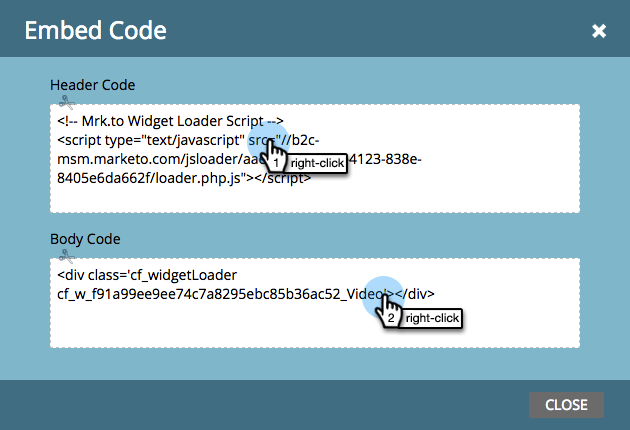

# 在您的網站上部署Social {#deploy-social-on-your-website}

在非Marketo頁面上內嵌社交應用程式。

>[!AVAILABILITY]
>
>如需詳細資訊，請聯絡您的銷售代表。

您可以在自己的網站上部署社交應用程式，以吸引對象參與，並讓每個人都參與社交網路上的大型對話。 當人們在社交網路上與其朋友分享您的促銷活動和內容時，您會在您的網站上產生更多流量。

1. 選取核准的社交應用程式，例如YouTube影片或社交按鈕。

   

1. 選取 **內嵌程式碼** 來自社交應用程式動作。

   

1. 複製網站頁首的程式碼(`<head>`)和內文(`<body>`)。

   

1. 將第一個程式碼片段貼入網站的頁首。

   

1. 將第二個程式碼片段貼到每個頁面中，讓您的社交應用程式顯示在頁面中。

   

1. 如果您需要將社交應用程式的大小設定為頁面上的特定維度，請新增 **outerHeight** 和 **外部寬度** 選項至第二個程式碼片段。 例如，您可以新增 `options='{"outerHeight":400, "outerWidth":600}'`，如下所示：

   

   您的Marketo社交應用程式現在會將內容和互動性新增至您的網站，邀請粉絲、訪客和現有客戶傳達與您相關的訊息。 同時，它會將其設定檔資料新增至您的資料庫，並追蹤社交影響力量度。

   >[!MORELIKETHIS]
   >
   >* [自訂社交應用程式按鈕](/help/marketo/product-docs/demand-generation/social/configuring-social-actions/customize-social-app-button.md)
   >* [設定社交分享需求](/help/marketo/product-docs/demand-generation/social/social-functions/set-social-share-requirement.md)
   >* [將登入頁面發佈至Facebook](/help/marketo/product-docs/demand-generation/facebook/publish-landing-pages-to-facebook.md)
