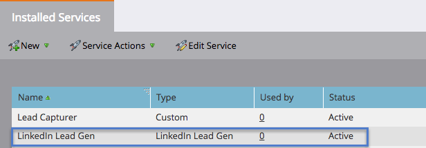

# 設定LinkedIn Lead Gen Forms {#set-up-linkedin-lead-gen-forms}

使用LinkedIn Lead Gen Forms在LinkedIn中執行廣告促銷活動，並為Marketo產生銷售機會。

>[!NOTE]
>
>**需要管理權限**

1. 前往Marketo **管理**.

   

1. 前往 **LaunchPoint**，按一下 **新增** 選取 **新服務**.

   

1. 輸入 **顯示名稱** 針對您的服務，請選取 **linkedIn領先代** 服務，然後按一下 **下一個**.

   

1. Marketo會在相同瀏覽器中開啟新標籤 [linkedin.com](https://www.linkedin.com). 使用您要用於整合的帳戶登入LinkedIn。

   >[!NOTE]
   >
   >LinkedIn帳戶需要存取您建立贊助行銷活動的所有LinkedIn商業帳戶。

   

1. 登入LinkedIn後，返回Marketo，按一下 **授權**.

   

1. 出現提示時，按一下 **允許** 接受Marketo應用程式安裝至LinkedIn。

   

1. 你會發現你現在被授權了。 按一下 **下一個**.

   

   >[!CAUTION]
   >
   >授權一年後，服務會自動過期。 要重新獲得訪問權，只需按一下 **重新授權**. 視您的瀏覽器設定而定，您可能必須重新輸入LinkedIn密碼。

1. 選取您希望LinkedIn Lead Gen銷售機會從進入Marketo的帳戶，然後按一下 **下一個**.

   >[!TIP]
   >
   >如果您沒有看到您期望的業務帳戶，請確保正在授權的用戶的LinkedIn帳戶具有LinkedIn中業務帳戶的Lead Gen Form Manager權限。

   

1. 若要接受預設的LinkedIn至Marketo欄位對應，只需按一下 **建立**. 如果您想要變更預設欄位對應、移除欄位對應或新增新欄位對應，您可以透過下列強制回應，依每個欄位執行此作業。

   >[!CAUTION]
   >
   >Marketo支援將兩個LinkedIn欄位對應至單一Marketo欄位， **但只有** 兩個LinkedIn欄位不同於同一表單。 如果您將同一個LinkedIn表單的兩個欄位對應至單一Marketo欄位，使用者可能無法輸入您的Marketo資料庫。

   

   >[!NOTE]
   >
   >僅限已儲存至的LinkedIn欄位 [表單範本](https://www.linkedin.com/help/lms/answer/79634) 在LinkedIn Campaign Manager中，會顯示為可對應至Marketo欄位的LinkedIn欄位。

   

幹得好！ 當您在LinkedIn端執行成功的行銷活動時，提交LinkedIn Lead Gen表單的人將開始流入Marketo。

>[!NOTE]
>
>您只能授權單一LinkedIn使用者帳戶。 如果您有多個要連結至Marketo的業務帳戶，請確定正在授權的使用者LinkedIn帳戶具有LinkedIn中業務帳戶的Lead Gen Form Manager權限。

>[!MORELIKETHIS]
>
>[在智慧行銷活動中使用LinkedIn銷售機會一般表單篩選器和觸發器](/help/marketo/product-docs/demand-generation/social/social-functions/use-linkedin-lead-gen-form-filters-and-triggers-in-a-smart-campaign.md)
