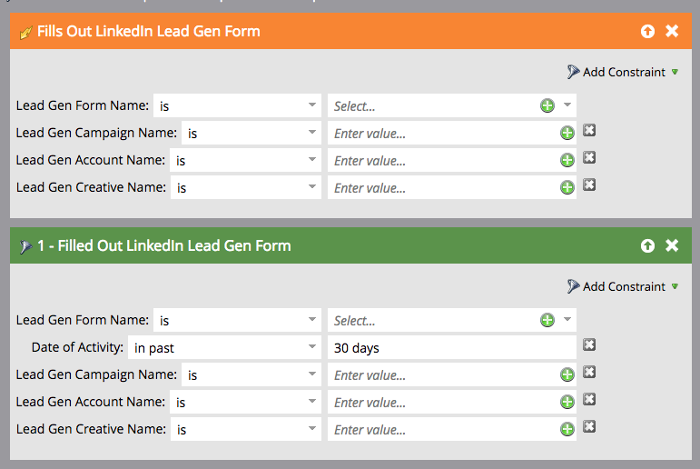

# 在智慧行銷活動中使用LinkedIn銷售機會一般表單篩選器和觸發器 {#use-linkedin-lead-gen-form-filters-and-triggers-in-a-smart-campaign}

啟用LinkedIn Lead Gen Forms後，您就可以在智慧行銷活動中將其用作篩選和觸發器。

>[!NOTE]
>
>當人們以LinkedIn Lead Gen Form提交其資訊時，該資訊會立即推送至Marketo，使表單可在Lead Gen Form Name下拉式清單中使用。 至少有一人提交表單後，表單名稱才會顯示。

1. 使用 **填寫LinkedIn Lead Gen表** 觸發以立即採取動作，或 **填寫LinkedIn Lead Gen表** 篩選已排程的批次促銷活動或標準智慧清單篩選。

   

1. 添加限制以進一步限制結果。

   
