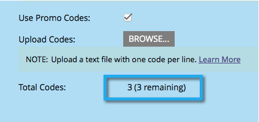

# 使用促銷代碼進行優惠方案履行 {#use-promo-codes-for-offer-fulfillment}

當您建立反向連結優惠方案或抽獎活動時，可以傳送促銷（抵用券）代碼給每個獲勝者。 為了獲得獎勵，他們使用程式碼，例如在您網站上某次購買的結帳頁面上。

## 上傳促銷代碼 {#upload-promo-codes}

1. 前往 **行銷活動**.

   

1. 選取反向連結選件，然後按一下 **編輯草稿**.

   

1. 在反向連結選件編輯器中，前往 **應用程式設定** 然後 **優惠方案詳細資訊**.

   

1. 在「電子郵件」下，選取 **使用促銷代碼**，並在「上傳程式碼」下，按一下 **瀏覽** 從系統中選擇促銷代碼檔案。

   

1. 促銷代碼檔案必須是純ASCII文本檔案，每行一個代碼，副檔名為.txt。 例如：

   

   >[!CAUTION]
   >
   >促銷代碼檔案中的任何空白字元會視為該行代碼的一部分。 請特別小心，避免每行結尾出現空格。

1. 上傳完成時，會顯示上傳的代碼總數。

   

## 檢閱已傳送的促銷代碼 {#review-sent-promo-codes}

一旦參與者開始獲得您的優惠獎勵，您就可以看到哪些促銷代碼已發送給誰以及何時。

>[!NOTE]
>
>僅Marketo使用者 _訪問獎_ 權限可存取此資訊。 請參閱  [管理使用者角色和權限](/help/marketo/product-docs/administration/users-and-roles/managing-user-roles-and-permissions.md).

1. 前往 **行銷活動**.

   

1. 選取您的轉介選件或抽獎活動，然後按一下 **參與者** 標籤。

   

1. 您應該會在此看到一些項目。 按一下 **促銷代碼** 欄位，查看已傳送給該參與者的促銷代碼，以及傳送時間。

   
