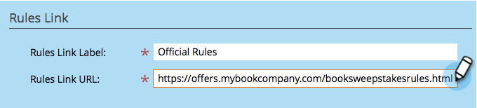

# 建立抽獎活動 {#create-sweepstakes}

抽獎活動讓人們有機會贏得獎品，回報是告訴朋友你的事。 您可以將其放置在登陸頁面、您的網站，甚至Facebook。

>[!AVAILABILITY]
>
>並非所有客戶都購買過此功能。 如需詳細資訊，請連絡您的銷售代表。

1. 在程式內，選取 **新增** > **新本機資產**.

   

1. 在「本地資產庫」中，按一下 **抽獎活動**.

   

1. 為您的抽獎活動命名。

   

   >[!TIP]
   >
   >若要節省時間，您可以使用 **克隆自** 從現有抽獎活動複製所有設定的選項。

   抽獎活動編輯器會在新視窗中開啟。 預設設定都正常，但您仍需要設定一些詳細資訊。 我們將在後續步驟中向您展示如何操作。

1. 按一下 **抽獎活動詳細資訊**.

   

1. 選取頻率、開始和結束日期，以及您的時區。

   

   >[!NOTE]
   >
   >對於每日和每週繪圖，開始和結束時間分別固定在上午12點和晚上11:59。 對於一次性繪圖，您可以選擇自己的開始和結束時間。

1. 按一下 **進階選項**.

   

1. 新增抽獎活動規則的連結。 輸入URL。 此連結為必要項目。

   

   該連結將顯示在共用消息螢幕的底部。

   >[!NOTE]
   >
   >在此畫面上，您也可以新增隱私權原則連結。 請參閱 [將您的隱私權原則新增至社交應用程式](/help/marketo/product-docs/demand-generation/social/social-functions/add-your-privacy-policy-to-a-social-app.md).

1. 按一下 **完成**.

   

1. 按一下 **核准並關閉**.

   

   >[!TIP]
   >
   >若要變更抽獎活動中的任何預設值，請按一下 **返回**. 若要儲存您的作品以供稍後不核准，請按一下 **關閉**.

如果抽獎活動中有任何問題，系統會提示您在抽獎活動獲得核准前解決這些問題。

恭喜您！您已建立抽獎活動。

>[!MORELIKETHIS]
>
>下一步是 [發佈抽獎活動](/help/marketo/product-docs/demand-generation/social/sweepstakes/publish-a-sweepstakes.md)，但您可以變更抽獎活動的外觀和設定。 開始於 [自訂抽獎活動樣式](/help/marketo/product-docs/demand-generation/social/sweepstakes/customize-sweepstakes-styles.md).
