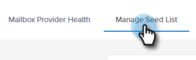

# Email Deliverability Power Pack：如何匯入種子清單 {#email-deliverability-power-pack-how-to-import-a-seed-list}

種子清單是多個信箱提供者(包括Google應用程式、Hotmail、Yahoo！等)的電子郵件帳戶清單，用於估計收件匣相對於垃圾郵件資料夾傳遞率。 以下說明如何將該清單帶入您的Marketo執行個體。

>[!AVAILABILITY]
>
>並非所有客戶都已購買此功能。 如需詳細資訊，請聯絡您的銷售代表。

## 匯入種子清單 {#import-a-seed-list}

1. 在「我的Marketo」中選取「 」 **傳遞工具**.

   

1. Everest應用程式將會開啟。 在左側導覽列中，按一下 **In-Flight** 並選取 **收件匣位置**.

   

1. 按一下 **管理種子清單** 標籤。

   

1. 按一下「動作」下拉式清單，然後選取 **每行下載一個**.

   

   >[!NOTE]
   >
   >如果您希望Everest為您最佳化清單，請使用「種子清單最佳化程式」（位於頁面頂端）。

1. 匯出後，清單會在瀏覽器的下載資料夾中顯示為.txt檔案。 擷取它，以及 [匯入](/help/marketo/getting-started/quick-wins/import-a-list-of-people.md) 以靜態清單的形式放入您的Marketo執行個體中。

   

   >[!TIP]
   >
   >請務必以易於尋找的方式為清單命名。

   >[!CAUTION]
   >
   >您每月獲得的這些收件匣放置行銷活動數量有限。 若要瞭解您的訂閱金額，請參閱珠穆朗瑪峰中「帳戶設定>訂閱」底下的「訂閱」區段。 若要取得更多資訊，請聯絡您的Marketo銷售代表。

## 取得新的種子清單 {#acquiring-new-seedlists}

您的種子清單可能每個月都會變更。 請務必定期登入Email Deliverability Power Pack，並檢查您的種子清單的狀態。 在新增地址或需要您這端的更新時，您將會透過應用程式左下方的通知圖示收到提醒。

在Marketo中建立靜態清單後，您就可以開始傳送至該清單，以測試電子郵件的收件匣位置。
