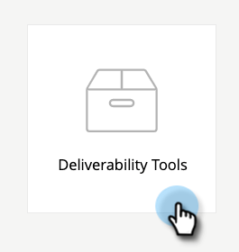

# 電子郵件傳遞能力Power Pack:如何導入種子清單 {#email-deliverability-power-pack-how-to-import-a-seedlist}

種子清單是多個郵箱提供商(包括Google應用程式、Hotmail、Yahoo！等)的電子郵件帳戶清單，這些提供商用於估算收件箱比垃圾郵件資料夾傳遞率。 以下說明如何將清單放入您的Marketo執行個體。

>[!AVAILABILITY]
>
>並非所有客戶都購買過此功能。 如需詳細資訊，請聯絡您的銷售代表。

## 導入種子清單 {#import-a-seedlist}

1. 在「我的Marketo」中，選取 **傳遞能力工具**.

   

1. 按一下 **收件箱線人**.

   

1. 按一下 **獲取種子清單**.

   

1. 按一下 **匯出清單**.

   

   >[!NOTE]
   >
   >選擇 **最佳化清單** 如果你想250ok [最佳化清單](https://help.returnpath.com/hc/en-us/articles/360046746451-What-is-250ok-s-seedlist-optimizer-and-why-should-I-use-it-) 為了你。 選擇 **自訂清單** 如果要選擇要包括的種子清單區域。

1. 匯出後，清單會在瀏覽器的下載資料夾中顯示為.txt檔案。 擷取它，然後 [匯入](/help/marketo/getting-started/quick-wins/import-a-list-of-people.md) 以靜態清單的形式傳入您的Marketo例項。

   

   >[!TIP]
   >
   >請務必以易於找到的方式為清單命名。

   >[!CAUTION]
   >
   >每月收到的收件箱線人活動數量有限。 要看看你有多少，看看你的250ok **帳戶設定**. 要獲取更多資訊，請聯繫您的Marketo銷售代表。

## 取得新種子清單 {#acquiring-new-seedlists}

您的種子清單每月都會更改。 請務必定期登入電子郵件傳遞能力Power Pack，並檢查種子清單的狀態。 當您的端子新增了新地址或需要更新時，您會透過「取得種子清單」頁面的介面收到警報。

建立Marketo中的靜態清單後，您就可以開始傳送至該清單，以測試電子郵件的收件匣位置。
