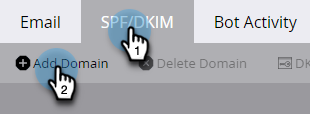
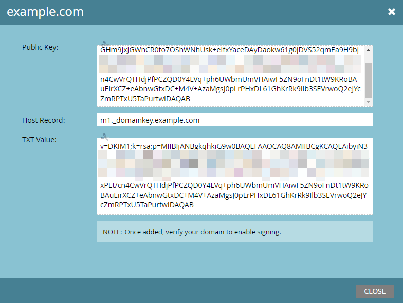

# 設定自訂DKIM簽章 {#set-up-a-custom-dkim-signature}

為確保最高傳遞能力，我們會使用共用的Marketo DKIM簽章自動簽署所有傳出郵件。

>[!NOTE]
>
>您可能需要IT團隊的協助，才能完成本文中的部分步驟。

您可以個人化DKIM簽章，以反映您選擇的網域。 方法如下。

1. 移至&#x200B;**管理員**&#x200B;區段。

   

   >[!NOTE]
   >
   >如果您以舊式方式設定自訂DKIM簽章，它將持續運作，並且應會在這裡顯示。

1. 按一下&#x200B;**電子郵件**。

   

1. 按一下&#x200B;**SPF/DKIM**&#x200B;標籤，然後&#x200B;**新增網域**。

   

1. 輸入您將在Marketo電子郵件中使用的網域作為寄件者地址。 選擇選擇器和金鑰大小。 完成時，按一下&#x200B;**新增**。

   

   <table> 
   <tr>
   <td width="20%"><b>選擇器</b></td>
   <td>用於找到DKIM記錄之公開金鑰部分的唯一字串/識別碼。 它可以是任意字串，或是要分隔並識別該DKIM金鑰/記錄的目的的唯一識別碼。</td>
   </tr>
   <tr> 
   <td width="20%"><b>金鑰大小</b></td>
   <td>您希望DKIM簽章加密使用的安全性等級。</td>
   </tr>
   </tbody>
   </table>

   

   >[!TIP]
   >
   >* 我們建議使用2048金鑰大小。
   >* 如果您在寄件者地址中使用不同的網域，我們將使用Marketo共用的DKIM簽章。

   >[!IMPORTANT]
   >
   >如果您需要更新網域的DKIM選擇器或DKIM加密大小，您必須刪除現有記錄並使用新值重新發佈新產生的記錄。
   >
   >請注意，這樣做時，在您的新記錄發佈並由我們的系統驗證之前，不會為您的網域簽署DKIM。 請針對變更進行相應的規劃，因為新的DKIM記錄可能需要24到48小時的時間才會完全傳播到網際網路。

1. 將&#x200B;**主機記錄**&#x200B;和&#x200B;**TXT值**&#x200B;傳送給您的IT。 請他們為您建立記錄，並確定紀錄會傳播至與來自網域關聯的所有名稱伺服器。 Marketo的DKIM驗證需要將DKIM金鑰傳播到與DKIM簽署的網域相關聯的所有名稱伺服器。

   

1. 一旦他們確認已建立記錄，請返回Marketo，選取您的網域，然後按一下&#x200B;**檢查DNS**。

   

   >[!NOTE]
   >
   >如果確認失敗，且您的IT已正確建立記錄，則可能與DNS傳播有關。 請稍後再試。

   >[!CAUTION]
   >
   >修改/移除對應的DNS記錄將會損害傳遞能力。 在進行DNS變更之前，請務必刪除Marketo中的專案。

   這絕對有助於您的電子郵件傳遞能力。 您應該取得記錄存在且正確的驗證。
