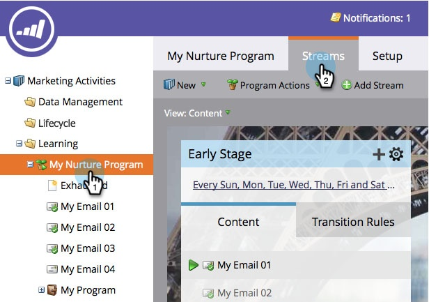

# 新增串流{#add-a-stream}

參與計畫可容納多個串流。 以下說明如何新增新增。

1. 前往&#x200B;**行銷活動**。

   

1. 選擇您的參與程式，然後按一下&#x200B;**流**&#x200B;頁籤。

   

1. 按一下&#x200B;**添加流**。

   

   >[!NOTE]
   >
   >每個參與計畫最多可新增25個串流。

   還有……完成！   

