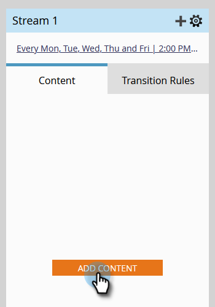

# 將內容新增至資料流 {#add-content-to-a-stream}

建立參與計畫後，您需要將內容新增到資料流。 您可以將電子郵件或程式新增至資料流。

1. 前往 **行銷活動**.

   

1. 選取您的參與計畫，然後前往 **串流** 標籤。

   

   您可以透過兩種不同的方式新增內容：

**新增內容按鈕**

1. 按一下 **新增內容** 按鈕。

   

1. 選擇 **電子郵件** _或_ **計畫**，然後選取您要新增的電子郵件或方案/智慧行銷活動。

   

   >[!TIP]
   >
   >此參與計畫的本機電子郵件將依序排序。

**+圖示**

1. 按一下 **+** 圖示，選擇 **電子郵件** _或_ **計畫**，然後選取您要新增的電子郵件或方案/智慧行銷活動。

   

   >[!NOTE]
   >
   >智慧型行銷活動必須包含 **參與計畫會員** 篩選以使其正常運作。

做得好！ 您現在知道如何將內容新增到您的方案資料流。 您可視需要新增更多內容，以利培養。 如需更多詳細資訊，請參閱下文相關文章。

>[!MORELIKETHIS]
>
>[將方案新增至參與方案流](/help/marketo/product-docs/email-marketing/drip-nurturing/creating-an-engagement-program/adding-a-program-to-an-engagement-program-stream.md)
