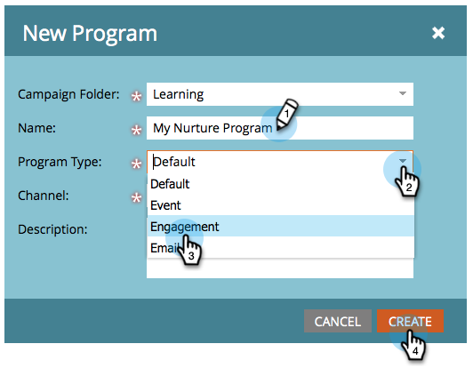

# 建立參與方案 {#create-an-engagement-program}

您可以使用Marketo中的參與計畫，輕鬆完成電子郵件培養。

1. 前往 **行銷活動**.

   

1. 選取您要在中建立參與方案的資料夾，然後按一下 **新增** 和 **新計畫**.

   

1. 輸入 **名稱**，選取 **參與** for **程式類型** 按一下 **建立**.

   

1. 好了，現在你有了訂婚計畫，我們開始吧。

   

   >[!MORELIKETHIS]
   >
   >* [新增內容至資料流](/help/marketo/product-docs/email-marketing/drip-nurturing/creating-an-engagement-program/add-content-to-a-stream.md)
   >* [設定資料流順序](/help/marketo/product-docs/email-marketing/drip-nurturing/engagement-program-streams/set-stream-cadence.md)

