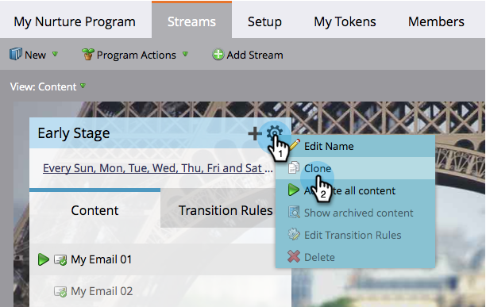
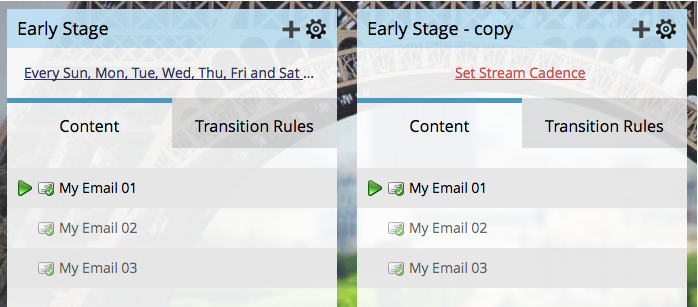

# 複製資料流 {#clone-a-stream}

基於各種原因複製資料流，包括測試不同的訂單和不同的步調。

1. 選取您的參與計畫，並前往 **串流** 標籤。

   

1. 按一下串流齒輪圖示，然後按一下 **原地複製**.

   

   >[!NOTE]
   >
   >每個參與計畫最多可以有25個串流。

   做得很好！ 您不喜歡讓生活更輕鬆的事物嗎？

   

   >[!CAUTION]
   >
   >串流中的所有專案都會複製，但Cadence除外。 請記得設定。
