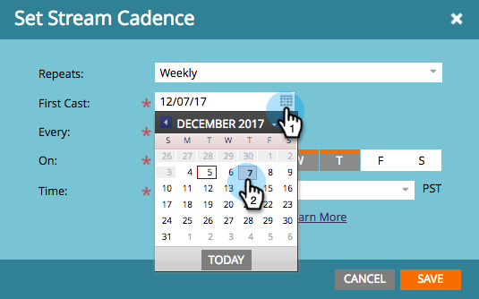
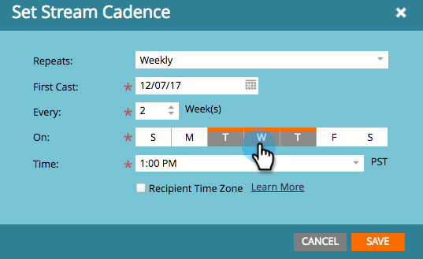

# 設定串流順序{#set-stream-cadence}

您可以視需要，以任何間隔傳送參與內容。 例如：每週一次，或每三個星期二一次。

## 設定Cadence {#set-cadence}

1. 前往&#x200B;**行銷活動**。

   

1. 尋找並選取您的參與程式，按一下&#x200B;**串流**&#x200B;標籤，然後按一下&#x200B;**設定串流順序**。

   

1. 選取要重複出現節奏的頻率。 您可以選擇&#x200B;**每週**&#x200B;或&#x200B;**每月**。

## 每週{#weekly}

1. 選擇&#x200B;**每週**。

   

   >[!NOTE]
   >
   >選擇&#x200B;**無**&#x200B;將關閉流。

1. 選擇第一次播放的日期。

   

1. 現在，您可以選擇是否希望每週都有節奏，或者間隔更遠。 我們每兩週挑一次。

   

1. 決定一週中哪幾天。 在這個例子中，我們在星期二、星期三和星期四。

   

   >[!TIP]
   >
   >您可以選擇&#x200B;**重複：每週** / **每：1週** / **On**:所有日子。

   現在選擇時間。 如果要使用[收件者時區](/help/marketo/product-docs/email-marketing/drip-nurturing/engagement-program-streams/set-stream-cadence/schedule-engagement-programs-with-recipient-time-zone.md)（即根據本地時區傳送），請勾選此框，然後按一下&#x200B;**保存**。

   

   >[!CAUTION]
   >
   >內容會在您為第一次轉播選擇的日期推出，因此請務必與您選擇的一週中的某天一致；否則第一週就會出去兩次。

1. 將滑鼠暫留在舞廳上。 你會看到未來的投票日期。

   

   >[!NOTE]
   >
   >在此範例中，將於星期四傳送電子郵件。 然後，我們略過一週，然後在下週的星期二、星期三和星期四再次傳送。 然後我們再循環。

就這樣！ 如果您想設定月度節目，請繼續閱讀。

## 每月{#monthly}

1. 選擇&#x200B;**Monthly**&#x200B;以瞭解其重複頻率。

   

1. 選擇第一次播放的日期。

   

1. 如果您希望每月或更多間隔……我們每四個月選一次。

   

1. 選擇您指定的月份的哪一天，在此例中是每4月22日。

   

   >[!TIP]
   >
   >或者，您也可以選擇一週中的某天。

1. 選擇&#x200B;**Time**&#x200B;並按一下&#x200B;**保存**。

   

1. 將滑鼠暫留在舞廳上。 你會看到未來的投票日期。

   

   >[!CAUTION]
   >
   >如果您稍後決定修改參與串流順序，請確定第一個轉播設定為未來日期。

現在您知道如何設定串流節奏了！

>[!MORELIKETHIS]
>
>* [瞭解收件者時區](/help/marketo/product-docs/email-marketing/email-programs/email-program-actions/scheduling-with-recipient-time-zone/understanding-recipient-time-zone.md)
>* [與收件者時區排程參與計畫](/help/marketo/product-docs/email-marketing/drip-nurturing/engagement-program-streams/set-stream-cadence/schedule-engagement-programs-with-recipient-time-zone.md)

