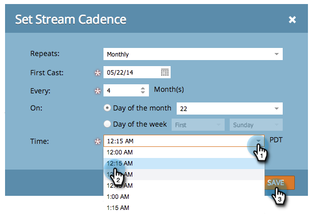

# 設定資料流順序 {#set-stream-cadence}

您可以隨時傳送參與內容。 例如：每週一次，或每個月的第三個星期二。

## 設定順序 {#set-cadence}

1. 前往 **行銷活動**.

   

1. 尋找並選取您的參與方案，按一下 **資料流** ，然後按一下 **設定資料流順序**.

   

1. 選取要重複循序的頻率。 您可以選擇 **每週** 或 **每月**.

## 每週 {#weekly}

1. 選擇 **每週**.

   

   >[!NOTE]
   >
   >選取 **無** 會關掉溪流。

1. 選擇第一次播放的日期。

   

1. 現在，選擇您是希望每週執行此節奏，還是讓節奏更加間隔。 我們每兩週挑一次。

   

1. 決定一週中的哪幾天。 在這個例子中，我們在星期二、星期三和星期四進行。

   

   >[!TIP]
   >
   >您可以借由選擇 **重複：每週** / **每：1週** / **開啟**:一整天。

   現在，選擇時間。 如果您想要使用，請核取方塊 [收件者時區](/help/marketo/product-docs/email-marketing/drip-nurturing/engagement-program-streams/set-stream-cadence/schedule-engagement-programs-with-recipient-time-zone.md)（即根據當地時區傳送），然後按一下 **儲存**.

   

   >[!CAUTION]
   >
   >內容會在您為首次轉播選擇的日期傳出，因此請確定與您選擇的當周某日一致；否則第一週會出去兩次。

1. 將滑鼠移到節奏上。 你會看到未來的日子。

   

   >[!NOTE]
   >
   >在此範例中，星期四會傳送電子郵件。 然後，我們略過一週，然後在下週的星期二、星期三和星期四再次發送。 然後我們再次循環。

就這樣！ 如果要設定每月節目，請繼續閱讀。

## 每月 {#monthly}

1. 選擇 **每月** 重複的頻率。

   

1. 選擇第一次播放的日期。

   

1. 選取是否要每月或更間隔……我們每四個月選一次。

   

1. 選取您指定的月份的哪一天，在此例中是每4個月的22。

   

   >[!TIP]
   >
   >或者，您也可以選擇一週中的某天。

1. 選擇 **時間** 按一下 **儲存**.

   

1. 將滑鼠移到節奏上。 你會看到未來的日子。

   

   >[!CAUTION]
   >
   >如果您決定稍後修改參與資料流順序，請確定第一個轉換設為未來日期。

現在你知道如何設定串流節奏了！

>[!MORELIKETHIS]
>
>* [了解收件者時區](/help/marketo/product-docs/email-marketing/email-programs/email-program-actions/scheduling-with-recipient-time-zone/understanding-recipient-time-zone.md)
>* [與收件者時區排程參與方案](/help/marketo/product-docs/email-marketing/drip-nurturing/engagement-program-streams/set-stream-cadence/schedule-engagement-programs-with-recipient-time-zone.md)

