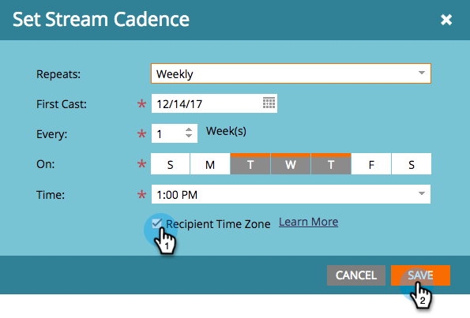

# 根據收件者時區安排參與方案的時間 {#schedule-engagement-programs-with-recipient-time-zone}

當您排程參與方案串流且收件者時區處於作用中狀態時，方案轉換將在第一個時區的午夜開始執行(UTC +14:00)。 第一個演員必須排程在未來&#x200B;**至少25小時**，因為全球每個時區可能有符合演員資格的人。 在第一個時區的這個時間開始處理，可保證在每個收件者的排程日期和時間傳送電子郵件。

1. 在您的參與方案中，導覽至&#x200B;**[!UICONTROL Streams]**&#x200B;標籤，然後按一下資料流的步調排程以編輯它。

   

1. [設定您的步調設定](/help/marketo/product-docs/email-marketing/drip-nurturing/engagement-program-streams/set-stream-cadence.md)，如同您一般的設定，然後核取&#x200B;**[!UICONTROL Recipient Time Zone]**&#x200B;方塊。 請記住，您的第一次轉換必須在未來至少25小時進行。 按一下「**[!UICONTROL Save]**」。

   

1. 請注意，在收件者時區作用中時，步調排程將不會顯示特定時區，因為可能有多個。 它只會顯示小時。

   

>[!MORELIKETHIS]
>
>* [瞭解收件者時區](/help/marketo/product-docs/email-marketing/email-programs/email-program-actions/scheduling-with-recipient-time-zone/understanding-recipient-time-zone.md)
>* [設定資料流頻率](/help/marketo/product-docs/email-marketing/drip-nurturing/engagement-program-streams/set-stream-cadence.md)
