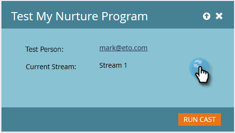

# 測試參與資料流 {#test-an-engagement-stream}

將所有內容新增至資料流後，您就可以一次測試其中一段內容。

1. 前往 **行銷活動**.

   

1. 選取您的參與方案。

   

1. 按一下 **計畫操作** 選取 **測試資料流**.

   

1. 從 **測試人員** 下拉式清單。 記住，內容實際上會消失，因此在選擇時請記住。

   

   >[!CAUTION]
   >
   >請確定您的測試人員是唯一的，且資料庫中沒有重複項目。

   >[!TIP]
   >
   >如果您要尋找的測試人員不存在，請使用 **建立人員** 選項即時建立。

   按一下「初始流」，選擇要測試的流，然後按一下「運行轉換」。
   

1. 當該人通過 [轉換規則](/help/marketo/product-docs/email-marketing/drip-nurturing/engagement-program-streams/transition-people-between-engagement-streams.md) 按一下「重新整理」圖示。

   

1. 將會出現新資料流，表示測試成功。

   

   幹得好！

   >[!NOTE]
   >
   >除非您按一下 **再次運行Cast**.
