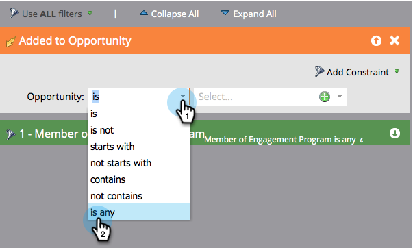

# 在參與資料流之間轉換人員 {#transition-people-between-engagement-streams}

參與程式可以有多個資料流。 若您 [新增資料流](/help/marketo/product-docs/email-marketing/drip-nurturing/creating-an-engagement-program/add-a-stream.md)，您會想要定義人們從一個資料流移至另一個資料流的方式。 這些稱為 **轉變規則。**

1. 前往 **行銷活動**.

   

1. 選擇您的多流參與計畫，然後轉到 **資料流**.

   

1. 按一下 **轉換規則** 若要從其他資料流提取資料流，請按一下 **編輯轉變規則**.

   

   >[!NOTE]
   >
   >轉變規則會拉進資料流；一律定義您要拉進之資料流的規則。

   轉換規則視窗開啟後，在您選擇的觸發器中尋找並拖曳。 在此情況下，我們希望在將人員添加到機會時將其移動到Mid Stage。

   

1. 將運算子設為 **是** 這樣人們就會為了任何增加的機會而遷移。

   

   >[!TIP]
   >
   >您可以將多個觸發器和篩選器新增至轉變規則，但轉變規則會使用所有篩選器（只有使用「全部」篩選器選項）。 如果您需要在轉變規則中使用OR，建議您改為設定外部智慧型促銷活動。

1. 按一下 **關閉**。

   

   太棒了！ 現在，您參與計畫中添加到機會的任何人員都將移至Mid Stage流。

   

   >[!NOTE]
   >
   >上述步驟 *do* 向 [暫停](/help/marketo/product-docs/email-marketing/drip-nurturing/using-engagement-programs/pause-people-in-an-engagement-program.md) 還有。
