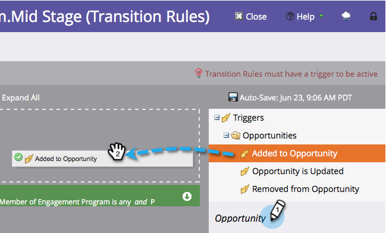

# 在參與資料流之間轉變人物 {#transition-people-between-engagement-streams}

參與計畫可以有一個以上的資料流。 如果您 [新增資料流](/help/marketo/product-docs/email-marketing/drip-nurturing/creating-an-engagement-program/add-a-stream.md)，您會想要定義人們在不同資料流之間移動的方式。 這些稱為 **轉變規則。**

1. 前往 **行銷活動**.

   

1. 選取您的多重串流參與方案，並前往 **串流**.

   

1. 按一下 **轉換規則** 針對您要從其他串流提取到的串流，然後按一下 **編輯轉變規則**.

   

   >[!NOTE]
   >
   >轉換規則提取到資料流中；請一律在您要提取的資料流上定義規則。

   轉換規則視窗開啟後，在您選擇的觸發程式中尋找並拖曳。 在此案例中，我們想在新增至機會時將人員移至Mid Stage。

   

1. 讓我們將運運算元設為 **為任何** 讓人員移動以取得任何新增的機會。

   

   >[!TIP]
   >
   >您可以將多個觸發器和篩選器新增至轉變規則，但轉變規則會使用所有篩選器（唯一選項是使用「全部」篩選器）。 如果您需要在轉變規則中使用OR，建議您改為設定外部智慧行銷活動。

1. 按一下 **關閉**。

   

   太棒了！ 現在，您參與方案中的任何人員，只要新增至機會，都會移至中段資料流。

   

   >[!NOTE]
   >
   >上述步驟 *do* 適用於以下人員： [暫停時](/help/marketo/product-docs/email-marketing/drip-nurturing/using-engagement-programs/pause-people-in-an-engagement-program.md) 以及。
