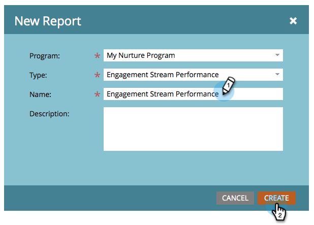

# 參與資料流績效報表 {#engagement-stream-performance-report}

想要了解您的參與內容的成效嗎？ 請嘗試使用參與資料流效能報表。

## 建立報表 {#create-the-report}

1. 尋找並選取您的參與方案，然後在 **新增** 按一下 **新本機資產**.

   

1. 選擇 **報表**.

   

   >[!TIP]
   >
   >在方案下建立報表會自動限制為方案的內容。

   選取「參與資料流效能」作為報表類型。
   

1. 為報表命名，然後按一下 **建立**.

   

   好吧！ 現在來查看設定。

## 編輯設定 {#edit-settings}

1. 尋找並選取您的報表。

   

1. 在 **設定** 按兩下 **參與計畫電子郵件** 篩選。

   

1. 選取您要報告的電子郵件，然後按一下 **套用**.

   

## 執行報表 {#run-report}

1. 若要執行報表，只需按一下 **報表** 標籤。

   

   >[!TIP]
   >
   >「參與分數」雖然沒有圖示，但是是此報表中的欄。 請參閱 [了解參與分數](/help/marketo/product-docs/email-marketing/drip-nurturing/reports-and-notifications/understanding-the-engagement-score.md) 以了解詳情。

   幹得好！ 請注意，報表會依參與方案分組。
