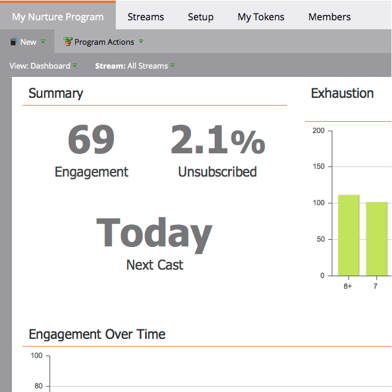

# 參與控制面板 {#the-engagement-dashboard}

「參與控制面板」是查看參與計畫內容執行情況的最簡單方式。

>[!NOTE]
>
>參與分數包含您最近三次轉播的資料。 每次轉播後72小時會計算新的一個。 深入了解 [參與分數](/help/marketo/product-docs/email-marketing/drip-nurturing/reports-and-notifications/understanding-the-engagement-score.md).

## 檢視參與控制面板 {#view-the-engagement-dashboard}

選取您的參與方案，然後按一下 **檢視** > **控制面板**.

>[!TIP]
>
>查看 [參與資料流績效報告](/help/marketo/product-docs/email-marketing/drip-nurturing/reports-and-notifications/engagement-stream-performance-report.md) 以取得更詳細的統計資料。

## 了解耗盡Widget {#understand-the-exhaustion-widget}

此介面工具集可協助您預測銷售機會何時耗盡所有內容。 在每次投放後立即計算耗盡分數。 以下範例顯示，在1個投影中，195個銷售機會將耗盡所有內容。

>[!NOTE]
>
>您必須前往「設定」標籤，確認「已用盡的內容通知」為 **開啟** ，查看上圖。 如果關閉，圖表會看起來不同。

>[!CAUTION]
>
>「筋疲力盡」的人在下一場中不會收到任何通信。

## 了解隨時間推移的參與度Widget {#understand-the-engagement-over-time-widget}

顯示一段時間內的平均參與分數，以及內容編輯的影響。

>[!AVAILABILITY]
>
>此功能是使用Marketo收入週期總管的客戶的附加元件。 如需詳細資訊，請連絡您的客戶成功經理。

若要顯示單一內容（而非平均內容），請按一下齒輪圖示，然後選取該內容。

## 了解最高參與Widget {#understand-the-highest-engagement-widget}

所有內容的清單，依最高參與分數排序。

若要變更排序，請按一下齒輪圖示，然後選取排序順序。

_最新_ 和 _最舊_ 是根據上次核准的時間。

>[!NOTE]
>
>了解更多 [建立參與方案](/help/marketo/product-docs/email-marketing/drip-nurturing/creating-an-engagement-program/create-an-engagement-program.md) 深潛。
