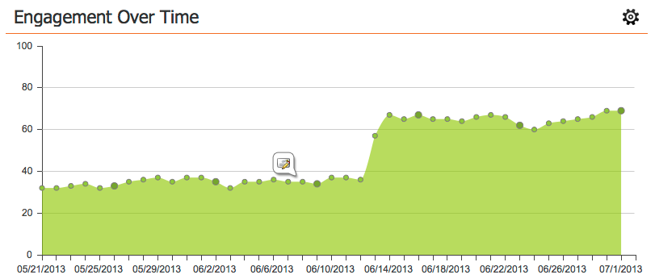

# 參與控制面板{#the-engagement-dashboard}

「參與儀表板」是您查看參與計畫內容執行情況的最簡單方式。

>[!NOTE]
>
>參與分數會在每次投影片後72小時計算。 進一步瞭解[參與分數](/help/marketo/product-docs/email-marketing/drip-nurturing/reports-and-notifications/understanding-the-engagement-score.md)。

## 檢視參與控制面板{#view-the-engagement-dashboard}

選擇您的參與計畫，然後按一下「檢視&#x200B;**** > **儀表板**」。

>[!TIP]
>
>請參閱[參與串流效能報告](/help/marketo/product-docs/email-marketing/drip-nurturing/reports-and-notifications/engagement-stream-performance-report.md)以取得更詳細的統計資料。

## 瞭解耗盡介面工具集{#understand-the-exhaustion-widget}

此介面工具集可協助您預測潛在客戶何時耗盡所有內容。 排除分數會在每次投影片後立即計算。 以下範例顯示，在1個投影片中，195個潛在客戶將耗盡所有內容。

>[!NOTE]
>
>您必須進入「設定」標籤，並確定「用完的內容通知」是&#x200B;**On**，才能查看上圖。 如果它們關閉，圖表會看起來不同。

>[!CAUTION]
>
>&quot;精疲力盡&quot;的人，在下一場演出中，將不會收到任何溝通。

## 瞭解隨時間推移的參與度Widget {#understand-the-engagement-over-time-widget}

顯示一段時間內的平均參與分數以及內容編輯的影響。

>[!AVAILABILITY]
>
>此功能可做為附加元件，供使用Marketo Revenue Cycle Explorer的客戶使用。 如需詳細資訊，請連絡您的客戶成功經理。

若要顯示單一內容而非平均值，請按一下齒輪圖示，然後選取該內容。

## 瞭解最高參與介面工具集{#understand-the-highest-engagement-widget}

所有內容的清單，依最高參與分數排序。

要更改排序，請按一下齒輪表徵圖，然後選擇排序順序。

_Newestand_ Oldestare是根 __ 據上次核准的時間。

>[!NOTE]
>
>進一步瞭解[建立參與計畫](/help/marketo/product-docs/email-marketing/drip-nurturing/creating-an-engagement-program/create-an-engagement-program.md)深入探討。
